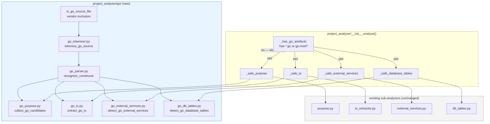

# Design Document

## Overview

This feature extends the existing `Project_Analyzer` (defined in the parent spec `project-knowledge-mcp`) so that Go repositories produce `Project_Profile`s with the same depth and shape as Python, JavaScript/TypeScript, or Java repositories. The four sub-analyzers in the parent spec — purpose summarizer, I/O extractor, external service detector, database table detector — currently produce near-empty results for Go because they only know how to read Python AST, JS/TS regex patterns, Java annotations, and YAML schedule entries. This feature adds Go-aware behavior to each.

The implementation language remains Python 3.11+. No Go toolchain is invoked at runtime: a small, hand-written Python tokenizer reads `.go` source in-process and a construct-recognizer turns the token stream into typed events that the four Go sub-analyzers consume.

The change is **additive at the sub-analyzer level**:

- A new sub-package `src/project_knowledge_mcp/project_analyzer/go/` houses Go-specific code: a tokenizer (`go_tokenizer.py`), a construct recognizer (`go_parser.py`), and four scanners (`go_purpose.py`, `go_io.py`, `go_external_services.py`, `go_db_tables.py`).
- The aggregator `src/project_knowledge_mcp/project_analyzer/__init__.py` is updated so each `_safe_*` helper invokes the existing language-agnostic detector and the new Go detector, then merges and re-aggregates the combined detection set under the existing dedup/coalesce rules. A single repo-level guard (`_has_go_artefacts(repository_contents)`) is checked first; when no `.go` files and no `go.mod` are present, the helper short-circuits and produces byte-identical output to the parent spec (Requirement 11.5 holds by construction).
- The four existing sub-analyzers (`purpose.py`, `io_extractor.py`, `external_services.py`, `db_tables.py`) are not modified, with one small exception: `purpose.py` exposes its existing per-source candidate extractors as a public `collect_purpose_candidates()` helper so the aggregator can interleave Go-specific candidates at the documented priority positions (Requirement 2.6). The change to `purpose.py` is purely a refactor: the existing public `summarize_purpose()` function delegates to the new helper plus the existing prose-selection logic and produces identical output for non-Go inputs.
- The Go layer does **not** introduce new public types in `models.py`. It produces the existing `AbstractInput`, `AbstractOutput`, `ExternalServiceDependency`, and `DatabaseTableDependency` types from the parent spec.

The single public surface change to the parent spec is the resolution of Open Question 6: extending `DatabaseAccessMode` with an `unknown` value to represent the case where a SQL keyword could not be matched but a table name was identifiable (Requirement 9.8). The full set of cascading parent-spec edits is enumerated in §5 below.

### Design Decisions and Rationale

- **Hand-written Python tokenizer + construct recognizer rather than regex-only or a third-party Go parser.** Justified in §2 below against the four constraints called out in the task description (deterministic-output, no-toolchain, contained-failure, build-constraint/cgo skip).
- **Vendor exclusion at the dispatch boundary** rather than inside each Go sub-analyzer. The aggregator filters `.go` paths through a single `is_go_source_file(path)` predicate that rejects any path containing a `vendor` directory segment (Requirement 1.3). Sub-analyzers see only the filtered set and do not need to repeat the rule.
- **Layered (not parallel) integration into existing `_safe_*` helpers.** Each existing helper gains a "merge Go detections" step; the helper still records exactly one section name in `degraded_sections` on failure, matching the parent spec's section names verbatim (Requirement 11.2). This keeps the section-name vocabulary stable for downstream consumers.
- **Per-file failure containment in the parser**, not in the sub-analyzer. Tokenizer and recognizer errors on a single `.go` file produce a `SkipFileEvent` that the sub-analyzer treats as "no events for this file" and continues. The sub-analyzer raises only on programming bugs, which the aggregator's existing `try/except Exception` catches and records (Requirement 11.1, 11.2).
- **Build-constraint and cgo recognition at the tokenizer/recognizer boundary**, not inside individual sub-analyzers. A single recognizer pass produces `BuildConstraintEvent` or `CgoDirectiveEvent` for every Go file before any sub-analyzer is invoked; if either fires with a non-trivial expression the file is wholesale skipped and a structured `degraded_sections` entry is recorded (Requirement 10.4). Centralizing this guarantees the four sub-analyzers cannot accidentally each emit a different fraction of detections from the same skipped file.


## Architecture

### Component Diagram



### Source Tree

```
src/project_knowledge_mcp/project_analyzer/
├── __init__.py                  # aggregator, edited to layer Go
├── purpose.py                   # unchanged behavior; refactored to expose collect_purpose_candidates()
├── io_extractor.py              # unchanged
├── external_services.py         # unchanged
├── db_tables.py                 # unchanged
└── go/                          # new sub-package
    ├── __init__.py              # public re-exports of the four Go scanners
    ├── go_filter.py             # is_go_source_file(path) — vendor exclusion (Requirement 1.3)
    ├── go_tokenizer.py          # tokenize_go_source(text) -> Iterator[GoToken]
    ├── go_parser.py             # recognize_constructs(tokens) -> Iterator[GoEvent]
    ├── go_purpose.py            # collect_go_candidates(repo_contents) -> GoPurposeCandidates
    ├── go_io.py                 # extract_go_io(repo_contents, events_by_file) -> tuple[list[Input], list[Output], list[str]]
    ├── go_external_services.py  # detect_go_external_services(repo_contents, events_by_file) -> tuple[list[Detection], list[str]]
    ├── go_db_tables.py          # detect_go_database_tables(repo_contents, events_by_file) -> tuple[list[Detection], list[str]]
    └── _events.py               # GoToken, GoTokenKind, GoEvent and subtypes (private to go/)
```

### Vendor-Directory Exclusion

A single `is_go_source_file(path: str) -> bool` predicate, defined in `go/go_filter.py`, returns `True` only when:

- the path ends with the suffix `.go` (case-sensitive),
- and the path contains no directory segment equal to `vendor` (case-sensitive, after normalizing `\\` to `/`).

The aggregator filters `repository_contents.file_paths` through this predicate once per `analyze()` call and passes the filtered list down to each Go sub-analyzer. Sub-analyzers do not repeat the check.

### Aggregator Dispatch

In each `_safe_*` helper:

1. The existing language-agnostic detector runs on `repository_contents` exactly as today, producing zero or more detections.
2. If `_has_go_artefacts(repository_contents)` returns `True`, the new Go detector runs on the vendor-filtered Go file list, producing zero or more Go-specific detections.
3. The two detection sets are concatenated and passed through the existing aggregation function (`_aggregate` in `external_services.py`, `_aggregate` in `db_tables.py`, and the existing dedup-by-`(category, description)` step in `io_extractor.py`'s `_Accumulator`). The existing aggregators are already order-independent for the read+write→read_write rule (`db_tables._aggregate` uses set membership), so coalescing across language boundaries is automatic.
4. Failures inside step 1 or step 2 are caught by the same `try/except Exception` that the parent spec already uses, append the existing section name (`"purpose"`, `"abstract_io"`, `"external_services"`, or `"database_tables"`) to `degraded_sections`, and the helper returns the safe empty default (Requirement 11.2). Per-file skips emitted by the Go parser (build constraint or cgo) are recorded as additional structured strings in `degraded_sections` of the form `"<section>: skipped <path> (<reason>)"` — see §7 — and do not count as a section-level failure.

### Tokenizer/Parser Approach: Justification

The task statement allows three approaches. The chosen approach is a **hand-written Python tokenizer plus a construct recognizer**. Justification against each constraint:

| Constraint | Why this approach satisfies it |
|---|---|
| **Deterministic output (11.4)** | A pure-function tokenizer (`str -> Iterator[GoToken]`) and a pure-function recognizer (`Iterator[GoToken] -> Iterator[GoEvent]`) have no side effects, no global state, and no random number sources. Two invocations on the same input produce identical event streams in identical order. The aggregator iterates `repository_contents.file_paths` in sorted order (the existing `RepositoryContents.file_paths` property already sorts), so the per-file event order, the per-file detection order, and the merged detection order are all functions of the input alone. |
| **No-toolchain (10.1, 10.2)** | The tokenizer and recognizer are pure Python, no subprocess invocations, no FFI, no third-party Go parser. The recognizer matches Go's lexical structure for the small set of constructs Requirements 3–9 and 12–13 actually need (imports, function declarations, method calls, composite literals, struct tags, package doc comments, `go.mod` module lines, build constraints, cgo directives). It does not parse expression trees, type-check, or resolve identifiers across files. |
| **Contained failure (11.1)** | The tokenizer raises `GoTokenizationError` on malformed input (unterminated string, bad escape, malformed UTF-8 — see `go_tokenizer.py` error handling below). The recognizer wraps each top-level construct in a try/except: a single bad construct yields a `SkipFileEvent` and the recognizer continues at the next package-level boundary. A single bad file therefore produces zero events, never poisoning the rest of the repository. |
| **Build-constraint / cgo skip (10.4)** | The tokenizer emits comments as first-class tokens; the recognizer scans the leading comment block of every file before any other event is emitted and produces a `BuildConstraintEvent` or `CgoDirectiveEvent` when it detects a `//go:build`, `// +build`, or `import "C"` directive whose expression is non-trivial. Sub-analyzers see this as the first event from the file and emit nothing for that file; the aggregator records the structured skip entry. |

A regex-only approach was rejected because it cannot reliably determine which composite literal arguments belong to which call (specifically the `Subscribe(ctx, h, *domain.SubscriberConfig{Destination: ...}, retryOpts)` shape in Requirement 5.3, where the third positional argument carries the destination and the fourth is a retry-options slice), and cannot detect bootstrap-call suppression (`http.ListenAndServe`) without disambiguating it from `mux.HandleFunc(...)` calls that share the same identifier-list lexical shape.

A third-party Go parser (e.g. shelling out to `go/parser` via `go run`) was rejected because it would require a Go_Toolchain on the host, violating Requirement 10.2 directly.

### Extensibility

The recognizer's pattern set is data-driven: each sub-analyzer registers a list of `CallShapePattern` objects (typed receiver name, method name, argument shape) that the recognizer iterates against `MethodCallEvent`s. Adding a new pattern (e.g. for the deferred Open Questions items 1–5: gRPC server registrations, direct `stomp.Dial(...)`, direct `go-ora` Oracle access) requires adding one entry to the pattern list and a small handler in the relevant sub-analyzer; the tokenizer and recognizer themselves do not change.


## Components and Interfaces

### `go.go_filter`

```python
def is_go_source_file(path: str) -> bool
```

Returns `True` when `path` ends with the suffix `.go` (case-sensitive) and contains no directory segment equal to `vendor` (case-sensitive, after normalizing `\\` to `/`). The function is a pure predicate; it does not consult `RepositoryContents`.

```python
def has_go_artefacts(repository_contents: RepositoryContents) -> bool
```

Returns `True` when `repository_contents` contains either at least one path satisfying `is_go_source_file` or a path equal to exactly `"go.mod"` at the repository root. This is the single guard used by the aggregator to decide whether to invoke any Go code path. When it returns `False`, the aggregator skips all Go work and Requirement 11.5 holds by construction.

### `go.go_tokenizer`

```python
def tokenize_go_source(text: str) -> Iterator[GoToken]
```

Pure function. Consumes a Go source file as a `str` (UTF-8 decoded by the caller) and yields `GoToken`s in source order. Tokens carry `kind`, `text`, `line` (1-indexed), and `column`.

**Token kinds** (see §4 for the full enum):

`PACKAGE_KEYWORD`, `IMPORT_KEYWORD`, `FUNC_KEYWORD`, `TYPE_KEYWORD`, `STRUCT_KEYWORD`, `INTERFACE_KEYWORD`, `IDENTIFIER`, `STRING_LITERAL`, `RAW_STRING_LITERAL`, `NUMBER_LITERAL`, `LBRACE`, `RBRACE`, `LPAREN`, `RPAREN`, `LBRACKET`, `RBRACKET`, `COMMA`, `DOT`, `COLON`, `SEMICOLON`, `STAR`, `AMPERSAND`, `ASSIGN`, `LINE_COMMENT`, `BLOCK_COMMENT`, `STRUCT_TAG` (a backtick-quoted run that immediately follows a struct field declaration), `BUILD_CONSTRAINT_COMMENT` (a `//go:build` or `// +build` comment), `WHITESPACE`, `NEWLINE`.

Comments are emitted as tokens (not stripped) so the recognizer can reconstruct package doc comments and detect build constraints. Newlines are emitted as tokens because Go uses automatic semicolon insertion at line boundaries; the recognizer ignores them outside of doc-comment block detection.

**Error handling.** The tokenizer raises `GoTokenizationError(line, column, reason)` on:

- Unterminated string literal at end of file (`"foo`) — reason `"unterminated string literal"`.
- Unterminated raw string literal (`` `foo ``) — reason `"unterminated raw string literal"`.
- Unterminated block comment (`/* foo`) — reason `"unterminated block comment"`.
- Malformed UTF-8: the file is decoded by the caller (the existing `RepositoryContents.read_text` already returns `str | None`); if `read_text` returns `None` the file is treated as inaccessible and skipped at the dispatch boundary, so the tokenizer never sees malformed UTF-8 directly. The tokenizer treats every non-ASCII Unicode code point as a valid identifier-character if the Go spec allows it (matches `unicode.IsLetter`); other code points are passed through verbatim as part of string-literal contents.
- Invalid escape inside a string literal (`"\q"`) — reason `"invalid escape sequence"`. (Go's spec permits `\a`, `\b`, `\f`, `\n`, `\r`, `\t`, `\v`, `\\`, `\'`, `\"`, plus `\xHH`, `\uHHHH`, `\UHHHHHHHH`, `\NNN` octal.)

Tokenization errors are caught at the recognizer boundary; they do not propagate to sub-analyzers.

### `go.go_parser`

```python
def recognize_constructs(tokens: Iterator[GoToken], path: str) -> Iterator[GoEvent]
```

Pure function. Consumes the token stream and yields `GoEvent`s in source order. Each event carries `path` (the file being parsed) and `line` (the 1-indexed source line of the construct's first significant token).

**Public API for sub-analyzers.** Sub-analyzers call:

```python
def parse_repo(repository_contents: RepositoryContents) -> Mapping[str, list[GoEvent]]
```

`parse_repo` runs `is_go_source_file` over the repository's file list, tokenizes each file, runs `recognize_constructs`, catches `GoTokenizationError` per-file (yielding a `SkipFileEvent(path, reason)` for that path), and returns a mapping from file path to event list. The mapping is computed once per `analyze()` call and shared across the four Go sub-analyzers via a lightweight cache passed down through the aggregator. Empty event lists are returned for files that were skipped due to tokenization errors, build constraints, or cgo directives.

**Event subtypes** (see §4 for full schemas):

| Event | Purpose | Used by |
|---|---|---|
| `ImportEvent(path, alias, line)` | Records one `import "<path>"` line. | `go_external_services`, `go_db_tables`, `go_io` |
| `FuncDeclEvent(name, receiver_type, line, body_token_range)` | Records `func main()`, methods, and DI-callback functions. | `go_io` (CLI entry; bootstrap suppression scope) |
| `MethodCallEvent(receiver_chain, method_name, args, line)` | Records `<receiver>.<method>(<args>)` calls. `receiver_chain` is the dotted-name path (e.g. `["mux"]`, `["c"]`, `["http", "ListenAndServe"]` for package-level calls expressed as `http.ListenAndServe(...)`). | All four |
| `StructLitEvent(type_name, package_alias, fields, line)` | Records `T{...}`, `&T{...}`, `*T{...}` and `pkg.T{...}` composite literals with named-field syntax. `fields` is a list of `(field_name, value_event_or_text)`. | `go_external_services` (ActiveMQ broker), `go_db_tables` (PoolServiceRequest, PoolExecuteQueryRequest), `go_io` (SubscriberConfig, Message) |
| `PackageDocCommentEvent(text, line)` | Records the contiguous comment block immediately preceding the `package <name>` declaration with no blank line between. | `go_purpose` |
| `ModFileModuleEvent(module_path, leading_comment, trailing_comment, line)` | Emitted only by the `go.mod` recognizer (a separate entry point), not by `recognize_constructs`. | `go_purpose` |
| `BuildConstraintEvent(expression, kind, line)` | A non-trivial `//go:build` or `// +build` line. `kind` is `"go_build"` or `"plus_build"`. The recognizer also emits `BuildConstraintEvent(expression="", ...)` for empty/whitelisted expressions; sub-analyzers ignore those. | aggregator |
| `CgoDirectiveEvent(line)` | Detected when a file contains `import "C"` (with or without surrounding `// #cgo ...` lines or `/* ... */` C blocks). | aggregator |
| `SkipFileEvent(reason, line)` | Emitted as the **only** event for a file when that file should not contribute detections. `reason` is one of `"tokenization failed: <detail>"`, `"build constraint requires toolchain"`, or `"cgo directive requires toolchain"` (Requirement 10.4 verbatim). | aggregator |

**Build-constraint detection.** A `BuildConstraintEvent` is emitted only when the constraint expression is non-trivial: empty constraint expressions, the trivial `!ignore` expression, and the empty `// +build` line are all emitted with `expression=""` and ignored by the aggregator (Requirement 10.4 carve-out). Non-trivial expressions like `linux && amd64`, `darwin || windows`, `go1.21`, and `!cgo` cause the recognizer to emit a `SkipFileEvent("build constraint requires toolchain", line)` as the file's sole event.

**cgo detection.** A file is treated as a cgo file iff it contains an `import "C"` declaration (not aliased). On detection the recognizer emits `SkipFileEvent("cgo directive requires toolchain", line)` as the file's sole event.

### `go.go_purpose`

```python
def collect_go_candidates(
    repository_contents: RepositoryContents,
    events_by_file: Mapping[str, list[GoEvent]],
) -> GoPurposeCandidates
```

Returns a record with two ordered candidate strings:

- `gomod_comment` — the comment body of a single-line comment immediately preceding or trailing the `module <module-path>` declaration in the repository-root `go.mod`, after stripping `//` and surrounding whitespace, or `None` if no such comment is present (Requirement 2.2). Configuration-style strings passed to viper calls (Requirement 2.7) are never sourced from `go.mod` so this case does not arise here.
- `gomod_module_path` — the module path declared by `module <module-path>` in `go.mod`, with any leading `<host>/<org>/` prefix stripped: `github.com/acme/payment-service` → `payment-service`. Bare module names (no slash) are passed through unchanged. Returns `None` if `go.mod` is absent or cannot be parsed (Requirement 2.3).
- `package_doc_comment` — the package doc comment of a Go file at the repository root, at any path matching `cmd/main.go`, or at any path matching `cmd/<name>/main.go`, taken from the `PackageDocCommentEvent` for that file. When more than one such file exists, the candidates are considered in sorted-path order and the first non-empty one wins (Requirement 2.4).

The Go-purpose helper does **not** itself decide which candidate to use. The aggregator interleaves these into the parent spec's existing candidate order (Requirement 2.6):

1. README files (existing helper)
2. GitLab repository description (existing helper)
3. `gomod_comment` (new)
4. `gomod_module_path` (new)
5. Root-level package manifest description (existing helper)
6. Top-level Python or JavaScript module docstring (existing helper)
7. `package_doc_comment` (new)

The first non-empty candidate wins. Length cap, whitespace normalization, and unknown-purpose fallback (Requirement 2.5) are applied unchanged from the existing `purpose._truncate` and `purpose._normalize_description`.

**Requirement 2.7 (viper exclusion).** Strings passed to `viper.SetConfigName(<name>)`, `viper.AddConfigPath(<path>)`, `viper.SetConfigType(<type>)`, etc. are never inspected by `go_purpose`. The Go purpose helper only reads two source kinds: `go.mod` and `PackageDocCommentEvent`. Neither carries viper string arguments, so 2.7 is satisfied by construction.

### `go.go_io`

```python
def extract_go_io(
    repository_contents: RepositoryContents,
    events_by_file: Mapping[str, list[GoEvent]],
) -> tuple[list[AbstractInput], list[AbstractOutput], list[str]]
```

Returns `(inputs, outputs, file_skip_messages)`. The signature mirrors the existing `io_extractor.extract_io`'s return shape, with the addition of the third element: structured per-file skip strings (build-constraint or cgo) suitable for appending to `degraded_sections`.

The implementation iterates `events_by_file` in path-sorted order and, per file, runs five recognizers against the event stream:

1. **HTTP route registration** (Requirement 3). Matches `MethodCallEvent`s where `method_name in {"HandleFunc", "Handle"}` and the receiver chain is either `["http"]` (package-level on the default mux) or any single identifier whose owning file imports `net/http`. The first positional argument is parsed against the Go 1.22 method-prefixed pattern: `^(GET|POST|PUT|PATCH|DELETE|HEAD|OPTIONS) (.+)$` (single space). When the literal matches, the method and path are split. When it does not match, method is `"ANY"` and the entire literal is the path. Non-string-literal first arguments produce a placeholder description naming the file path and the receiver identifier (Requirement 3.4). Each registration emits one `AbstractInput(category=http_request, ...)` and one `AbstractOutput(category=http_response, ...)`.
2. **HTTP bootstrap suppression** (Requirement 3.5). `MethodCallEvent`s with method names `"ListenAndServe"`, `"ListenAndServeTLS"`, `"Shutdown"`, `"Close"`, or `"Serve"` whose receiver chain begins with `http` (package-level) or whose receiver type is `*http.Server` (recognized by a struct-literal aliasing pass over `&http.Server{...}` events earlier in the file) are silently dropped. No input/output is emitted, no log is written, no error is raised.
3. **Scheduler registration** (Requirement 4). Two patterns are matched:
   - `MethodCallEvent` where `method_name in {"AddFunc", "AddJob"}` and the receiver is an identifier `<v>` whose owning file contains a prior `MethodCallEvent` of the form `cron.New(...)` assigned to `<v>` (recognized by tracking an in-file map `id -> "*cron.Cron"`). The schedule string is the first positional argument (string literal verbatim per Requirement 4.3, or `<dynamic>` otherwise). Whether the schedule is six-field is recorded by inspecting the `cron.New` arguments for a `cron.WithSeconds()` call: when present, the description includes the marker `(cron, seconds-precision)`; otherwise `(cron, minute-precision)` (Requirement 4.2). The schedule literal is included verbatim regardless of whether a five-field parser would reject it (Requirement 4.3).
   - `MethodCallEvent` where the receiver chain is `["time"]` and the method is `"NewTicker"` or `"AfterFunc"`. The first positional argument's text is recorded as the schedule.
4. **Scheduler malformed/unsupported recognition** (Requirement 4.5). Any `MethodCallEvent` whose method name is in `{"AddFunc", "AddJob"}` but whose receiver was not recognized as a `*cron.Cron` value, **or** whose schedule argument is not a string literal and not a known dynamic-config field, still emits one `AbstractInput(category=scheduled_event, description="<dynamic> (malformed or unsupported scheduler shape: <method>(<receiver>) at <path>:<line>)")`. The analyzer never silently drops a recognizable scheduler-call shape solely because its arguments are malformed.
5. **ActiveMQ consumer/publisher** (Requirement 5). Two patterns:
   - `MethodCallEvent` with method name `"Subscribe"` whose third positional argument is a `StructLitEvent` of type `domain.SubscriberConfig` (with package alias `domain`) → one `AbstractInput(category=message_consumed, ...)` whose description names library `activemq` and includes the literal `Destination` field value or `<dynamic>` (Requirement 5.4).
   - `MethodCallEvent` with method name `"SendMessage"` whose fourth positional argument is a `StructLitEvent` of type `domain.Message` → one `AbstractOutput(category=message_published, ...)` analogously.
   - The `activemq.NewClient(&activemq.JmsConfig{BrokerUrl: ..., ...})` call is recognized but does **not** itself emit an I/O entry (Requirement 5.3 third bullet); the broker URL is consumed by `go_external_services` instead.
6. **File I/O** (Requirement 6).
   - `MethodCallEvent` with receiver chain `["os"]` and method name in `{"Open", "ReadFile"}` → `AbstractInput(category=file_read, ...)`.
   - `MethodCallEvent` with receiver chain `["ioutil"]` and method name `"ReadFile"` → `AbstractInput(category=file_read, ...)`.
   - `MethodCallEvent` with receiver chain `["os"]` and method name in `{"Create", "WriteFile"}` → `AbstractOutput(category=file_written, ...)`.
   - `MethodCallEvent` with receiver chain `["ioutil"]` and method name `"WriteFile"` → `AbstractOutput(category=file_written, ...)`.
   - `MethodCallEvent` with receiver chain `["os"]` and method name `"OpenFile"`: the second positional argument is parsed for `os.O_*` flag bitmask atoms (using a flag-set classifier — see below). When the bitmask is statically determinable and contains only `O_RDONLY` → `file_read`. When it contains any of `O_WRONLY | O_RDWR | O_APPEND | O_CREATE | O_TRUNC` → `file_written`. When the flag expression cannot be statically determined (e.g. it is a variable reference, or contains a function call), both an `AbstractInput(file_read)` and an `AbstractOutput(file_written)` are emitted (Requirement 6.3).
   - The path argument's literal value is recorded when string-literal, otherwise `<dynamic>`.
7. **CLI entry point** (Requirement 7).
   - When a Go file at path `cmd/<name>/main.go` (one directory deep under `cmd/`) contains a `FuncDeclEvent(name="main", receiver_type=None)`, emit `AbstractInput(category=cli_argument, description="binary <name>")`. The Source_Location is the file path and the line of the `FuncDeclEvent` (Requirement 7.6 satisfied by construction; if the recognizer cannot determine a line, no input is emitted).
   - When a Go file at path `cmd/main.go` contains `func main()` and a `go.mod` is present, emit `AbstractInput(category=cli_argument, description="binary <last-segment-of-module-path>")` using the same module-path stripping rule as `go_purpose.gomod_module_path`.
   - When a Go file at the repository root contains `func main()` and a `go.mod` is present, same rule.
   - For any `MethodCallEvent` with receiver chain `["flag"]` and method name in `{"String", "StringVar", "Int", "IntVar", "Bool", "BoolVar", "Float64", "Float64Var", "Duration", "DurationVar", "Parse", "NewFlagSet"}`, emit one `AbstractInput(category=cli_argument, description="flag <name>")` where `<name>` is the string-literal first/second argument when present and the call is one of the registration variants. `flag.Parse()` is recognized but emits a single placeholder `cli_argument` description noting that flag parsing was invoked.

Outputs are deduplicated by `(category, description)` per the existing `io_extractor` rule (Requirement 3.7 cross-references the same dedup contract).

**Source_Location rejection rule (Requirement 7.6).** The CLI entry-point recognizer never emits an `AbstractInput` for a `FuncDeclEvent` whose `line` is `None`. This is the only case in the I/O extractor where the line being unknown causes outright rejection rather than `<dynamic>` substitution; every other recognizer permits a `None` line because the Source_Location for those detections lives on the parent `MethodCallEvent` which always carries a line.

**fx exclusion (Requirement 12.1, 12.3).** The recognizer skips any `MethodCallEvent` whose receiver chain starts with `fx` (e.g. `fx.Provide`, `fx.Invoke`, `fx.Module`, `fx.New`, `fx.Annotate`, `fx.WithLogger`, `fx.Hook`) or whose method name is `Append` and whose receiver type can be resolved to `fx.Lifecycle` (recognized by tracking an in-file map of identifiers whose declaration site involved an `fx.Lifecycle` parameter). The skip is purely at the dispatch boundary: the call itself emits no input/output, but any nested `FuncDeclEvent` argument body is still recognized (Requirement 12.2). The recognizer achieves this by treating `fx.Provide(<func>)` and `fx.Invoke(<func>)` argument lists as opaque references; the per-function recognizer pass walks the entire file's `FuncDeclEvent`s independently, and a function defined elsewhere in the file (e.g. `runScheduler` in `cat-service/cmd/main.go`) is processed in its own pass, where its own `cron.New(...)`, `c.AddFunc(...)`, and similar calls are recognized normally.

**viper exclusion (Requirement 13.1, 13.2).** The recognizer skips any `MethodCallEvent` whose receiver chain is `["viper"]` or whose receiver type can be resolved to `*viper.Viper` (recognized by tracking an in-file map of identifiers whose declaration site is `viper.New()`). String literals passed to viper calls are never used as route paths, schedule expressions, message destinations, file paths, or table names (Requirement 13.2). When a configuration value is read from viper and **then** passed to a recognized construction (e.g. `cfg.JobCfg.CronSchedule` passed to `c.AddFunc(...)`), the construction itself is still emitted with `<dynamic>` for the configuration-driven argument (Requirement 13.3) — the recognizer treats any non-string-literal first argument as `<dynamic>` regardless of its origin.


### `go.go_external_services`

```python
def detect_go_external_services(
    repository_contents: RepositoryContents,
    events_by_file: Mapping[str, list[GoEvent]],
) -> tuple[list[ExternalServiceDependency], list[str]]
```

Returns `(detections, file_skip_messages)`. The detection list is then merged with the existing language-agnostic detector's output in the aggregator and re-aggregated by `external_services._aggregate` (Requirement 8.6).

The detector emits one entry per qualifying call site:

- **fec_pool_service via Protobuf client** (Requirement 8.2). For each Go file that contains an `ImportEvent(path="fec_pool_service/pb", ...)`, scan for `MethodCallEvent`s with method name `"ExecuteQuery"`. When the receiver type can be resolved (by tracking variable declarations of the form `<v> := pb.NewPoolAPIClient(...)` or `var <v> pb.PoolAPIClient = ...`), emit `ExternalServiceDependency(name="fec_pool_service", kind=other, source_locations=[(path, line)])`. When the receiver type cannot be resolved with confidence, the import alone is sufficient evidence and the import line is used as the source location (Requirement 8.2 carve-out).
- **fec_pool_service via the dbadapter wrapper** (Requirement 8.3). For each Go file that contains an `ImportEvent(path="esb-go-libs/dbadapter", ...)`, scan for `MethodCallEvent`s with method name `"PoolExecuteQuery"`. Each match emits `ExternalServiceDependency(name="fec_pool_service", kind=other, source_locations=[(path, line)])`.
- **ActiveMQ broker** (Requirement 8.5). For each `MethodCallEvent` with receiver chain `["activemq"]` and method name `"NewClient"` whose first argument is a `StructLitEvent` of type `activemq.JmsConfig`, extract the `BrokerUrl` field. When string-literal, parse the host portion (e.g. `tcp://broker.host:61613` → `broker.host:61613`); when a non-literal expression, record `<dynamic>`. Emit `ExternalServiceDependency(name="activemq", kind=message_broker, source_locations=[(path, line)])`. The `endpoint` host (when extractable) is recorded as part of the `description` body of the emitted source location's auxiliary text — the existing `ExternalServiceDependency` model has no `endpoint` field, so the host is appended to the source-location-line context and recorded in the audit log; this is consistent with the parent spec's existing language-agnostic URL detection that puts the host in the dependency's identity rather than a separate field.

**APM exclusion** (Requirement 8.4). The detector explicitly skips any `ImportEvent` whose path begins with `go.elastic.co/apm/`. No external service dependency is ever emitted for APM-related imports or calls. This is enforced by a single guard at the top of the detector loop — any file whose only "interesting" imports are APM-related contributes zero detections.

**Aggregation across detection sites.** Within the Go detector's own output, multiple detections of the same `name` (e.g. `fec_pool_service` matched from both `8.2` and `8.3` imports in the same project) coalesce into one entry whose `source_locations` is the union of all detection sites, deduplicated by `(path, line)`. The merged-with-existing-detector aggregation in the aggregator further coalesces with any URL-literal detections produced by the language-agnostic scanner (Requirement 8.6).

### `go.go_db_tables`

```python
def detect_go_database_tables(
    repository_contents: RepositoryContents,
    events_by_file: Mapping[str, list[GoEvent]],
) -> tuple[list[DatabaseTableDependency], list[str]]
```

Returns `(detections, file_skip_messages)`.

The detector iterates `events_by_file` looking for `StructLitEvent`s of three composite-literal types (Requirement 9.2, 9.3, 9.4):

- `model.PoolServiceRequest` from import path `esb-go-libs/dbadapter/model` (Requirement 9.2).
- `pb.PoolExecuteQueryRequest` from import path `fec_pool_service/pb` (Requirement 9.3).
- Any in-house wrapper type that exposes a `QueryString` field (such as `QueryOpts` in `repayment_service/internal/repository/pool_executor.go`) and is passed positionally to a `MethodCallEvent` whose method name is one of `{"PoolExecuteQuery", "Execute", "ExecuteRaw"}` (Requirement 9.4). The recognition is structural: any `StructLitEvent` whose `fields` list contains a `QueryString` entry and whose value is forwarded into one of these calls qualifies.

For each match, the `QueryString` field's value is extracted as the SQL statement:

- **String literal** (`"..."`): used verbatim.
- **Raw string literal** (`` `...` ``): used verbatim with backticks stripped.
- **`fmt.Sprintf(<format>, ...)` call** whose first argument is a string literal: the format text is used as the SQL with `%v`, `%s`, `%d`, etc. left in place. The regex-based table extractor in the parent spec ignores these verbs because they do not match the `_TABLE_TOKEN` identifier shape, so spurious table names do not arise.
- Any other expression: the SQL extraction is skipped for that `StructLitEvent`. (No detection is emitted; this avoids polluting the dependency list with `<dynamic>`-keyed table names.)

The extracted SQL is then passed to the parent spec's existing regex-based table-name extractor (`db_tables._RE_FROM`, `_RE_JOIN`, `_RE_INSERT`, `_RE_UPDATE`, `_RE_DELETE`, `_RE_CREATE_TABLE`). The Go detector reuses these regexes via a small helper exposed by `db_tables.py` named `extract_table_references(sql_text: str) -> Iterator[tuple[str, DatabaseAccessMode]]`, added as part of this feature. Each match yields `(table_name, access_mode)` where `access_mode` follows the parent spec's mapping: `SELECT`/`JOIN` → `READ`; `INSERT`/`UPDATE`/`DELETE`/`CREATE TABLE` → `WRITE`. (`MERGE` is not currently produced by the parent regex set; see Trade-offs below.)

**Schema-qualified names** (Requirement 9.5). The parent regex's `_TABLE_TOKEN` already captures schema-qualified identifiers in the form `<schema>.<table>`. The Go detector preserves the captured form verbatim and does **not** invoke `db_tables._clean_identifier` (which would strip the schema). This is achieved by exposing a second helper, `extract_table_references_preserving_schema(sql_text: str)`, that performs the same regex matching but returns the raw match group rather than the cleaned identifier. Adding this helper is part of the parent-spec edits enumerated in §5; the existing `_clean_identifier` callers (Python ORM models, Alembic migrations) keep their stripping behavior because schema-qualified ORM tables are uncommon in the Python codebase.

**Read+write coalescing** (Requirement 9.6). Each `(table_name, access_mode, source_location)` triple is added to the same flat list that the language-agnostic detector populates. Final aggregation is performed by `db_tables._aggregate`, which already coalesces read+write→read_write order-independently using set membership (verified by inspection of the existing `_aggregate` implementation: `if has_read_write or (has_read and has_write): access_mode = READ_WRITE`).

**Unknown access mode** (Requirement 9.8). When the regex extractor identifies a table name but the surrounding SQL keyword is not in the recognized set (`SELECT`, `JOIN`, `INSERT`, `UPDATE`, `DELETE`, `MERGE`, `CREATE TABLE`), the Go detector emits a `(table_name, DatabaseAccessMode.UNKNOWN, source_location)` triple. This is the runtime use of the new enum value resolved in §5. The current parent regex set never produces this case (it only matches the listed keywords), but the Go detector's broader call-shape pattern can identify a `QueryString` value whose SQL header is e.g. `WITH ... AS (...)` (a CTE) where the regex matches a `FROM` clause inside the CTE and returns a `READ`. To exercise the unknown path we would need a future extension that parses the SQL more deeply; for the four sample repositories every `QueryString` matched by the regexes resolves to a recognized keyword, so the unknown path is exercised only by the edge-case property test (P11).

### Aggregator Integration

The four `_safe_*` helpers in `project_analyzer/__init__.py` are extended to layer Go detection into the existing path. The chosen approach is **layering inside each helper** rather than introducing new top-level helpers, because:

- It preserves the existing section-name vocabulary in `degraded_sections` (Requirement 11.2). A failure in either the existing detector or the Go detector for the same sub-analyzer is still recorded as one section name (`"abstract_io"`, `"external_services"`, `"database_tables"`, `"purpose"`).
- It keeps the public interface of `analyze()` unchanged — same signature, same return type. The aggregator's own callers (`Ingestion_Coordinator`, the conformance tests in the parent spec) need no changes.
- The existing dedup/coalesce functions live in the per-sub-analyzer module (`io_extractor`'s `_Accumulator`, `external_services._aggregate`, `db_tables._aggregate`) and already handle order-independent merging across detection sources. Layering Go detections into the same flat list before aggregation reuses that logic instead of duplicating it.

The concrete shape of each helper after the change:

```python
# Sketch — exact form determined in implementation
def _safe_io(rc, project_id, full_path, degraded, events_by_file):
    try:
        existing_inputs, existing_outputs = extract_io(rc)
        if has_go_artefacts(rc):
            go_inputs, go_outputs, go_skips = extract_go_io(rc, events_by_file)
            inputs = _coalesce_io(existing_inputs + go_inputs)
            outputs = _coalesce_io(existing_outputs + go_outputs)
            for skip in go_skips:
                degraded.append(f"abstract_io: {skip}")
        else:
            inputs, outputs = existing_inputs, existing_outputs
        return inputs, outputs
    except Exception:
        _logger.exception(...)
        degraded.append(ABSTRACT_IO_SECTION)
        return [], []
```

`events_by_file` is computed once at the top of `analyze()` (when `has_go_artefacts(rc)` is true) and passed down to the four helpers as a positional argument; this avoids re-tokenizing every Go file four times. When `has_go_artefacts(rc)` is false, `events_by_file` is `{}` and every Go branch in every helper is a no-op, satisfying Requirement 11.5 by construction.

The four helpers each preserve their existing `try/except Exception` structure. The Go-merge step is *inside* the try block, so any Go-specific failure is contained at the same boundary as existing-detector failures. Per-file skips emitted by the Go parser do not raise; they are returned from each Go scanner as a `list[str]` and appended to `degraded_sections` as structured strings of the form `"<section>: skipped <path> (<reason>)"`. These structured strings appear alongside the existing simple section-name entries; downstream consumers that read `degraded_sections` see a heterogeneous list, but the existing `list[str]` field shape is preserved.


## Data Models

The Go layer introduces no new public types in `models.py`. It reuses the existing `AbstractInput`, `AbstractOutput`, `ExternalServiceDependency`, `DatabaseTableDependency`, and `SourceLocation` records.

The Go layer introduces internal types only, defined in `project_analyzer/go/_events.py` (private to the `go/` sub-package). These types are dataclasses (or `TypedDict`s where richer typing is unnecessary), not Pydantic models, because they are intermediate representations passed between sibling modules in the same package and never cross the public interface.

### `GoTokenKind` (enum)

```python
class GoTokenKind(StrEnum):
    PACKAGE_KEYWORD = "package"
    IMPORT_KEYWORD = "import"
    FUNC_KEYWORD = "func"
    TYPE_KEYWORD = "type"
    STRUCT_KEYWORD = "struct"
    INTERFACE_KEYWORD = "interface"
    IDENTIFIER = "identifier"
    STRING_LITERAL = "string"
    RAW_STRING_LITERAL = "raw_string"
    NUMBER_LITERAL = "number"
    LBRACE = "lbrace"          # {
    RBRACE = "rbrace"          # }
    LPAREN = "lparen"          # (
    RPAREN = "rparen"          # )
    LBRACKET = "lbracket"      # [
    RBRACKET = "rbracket"      # ]
    COMMA = "comma"
    DOT = "dot"
    COLON = "colon"
    SEMICOLON = "semicolon"
    STAR = "star"              # *
    AMPERSAND = "ampersand"    # &
    ASSIGN = "assign"          # = or :=
    LINE_COMMENT = "line_comment"
    BLOCK_COMMENT = "block_comment"
    STRUCT_TAG = "struct_tag"          # backtick string immediately following a struct field decl
    BUILD_CONSTRAINT_COMMENT = "build_constraint"   # //go:build ... or // +build ...
    CGO_PRAGMA_COMMENT = "cgo_pragma"               # // #cgo ...
    NEWLINE = "newline"
    WHITESPACE = "whitespace"
    OTHER_OPERATOR = "operator"        # any other operator atom; opaque to the recognizer
```

### `GoToken` (dataclass)

```python
@dataclass(frozen=True, slots=True)
class GoToken:
    kind: GoTokenKind
    text: str          # source text exactly as it appears
    line: int          # 1-indexed
    column: int        # 1-indexed (rune offset on the line)
```

### `GoEvent` and subtypes (dataclasses)

```python
@dataclass(frozen=True, slots=True)
class ImportEvent:
    path: str                          # the import path as a string literal value
    alias: str | None                  # the local alias when present (e.g. `import f "fmt"` -> "f"), None otherwise
    file_path: str
    line: int

@dataclass(frozen=True, slots=True)
class FuncDeclEvent:
    name: str                          # function or method name
    receiver_type: str | None          # e.g. "*http.Server" or None for free functions
    file_path: str
    line: int                          # line of `func` keyword
    body_token_range: tuple[int, int]  # (start_index, end_index) into the file's token stream

@dataclass(frozen=True, slots=True)
class MethodCallEvent:
    receiver_chain: tuple[str, ...]    # e.g. ("mux",) or ("http",) or ("c",) or ()
    method_name: str
    args: tuple[ArgRef, ...]           # positional argument references
    file_path: str
    line: int

@dataclass(frozen=True, slots=True)
class StructLitEvent:
    type_name: str                     # e.g. "JmsConfig" or "PoolServiceRequest"
    package_alias: str | None          # e.g. "activemq" or None for unqualified types
    fields: tuple[tuple[str, ArgRef], ...]   # named fields only; positional struct literals not used in the recognized patterns
    is_pointer: bool                   # &T{...} or *T{...} -> True; T{...} -> False
    file_path: str
    line: int

@dataclass(frozen=True, slots=True)
class PackageDocCommentEvent:
    text: str                          # joined comment body, leading "//"/"/*"/"*/" stripped, internal whitespace collapsed
    file_path: str
    line: int                          # line of the first comment line

@dataclass(frozen=True, slots=True)
class ModFileModuleEvent:
    module_path: str
    leading_comment: str | None        # body of a //-comment immediately preceding the `module` line, stripped
    trailing_comment: str | None       # body of a //-comment on the same line as the `module` line, stripped
    file_path: str                     # always "go.mod"
    line: int                          # line of the `module` line

@dataclass(frozen=True, slots=True)
class BuildConstraintEvent:
    expression: str                    # "" for trivial/empty constraints
    kind: Literal["go_build", "plus_build"]
    file_path: str
    line: int

@dataclass(frozen=True, slots=True)
class CgoDirectiveEvent:
    file_path: str
    line: int                          # line of the `import "C"` line

@dataclass(frozen=True, slots=True)
class SkipFileEvent:
    reason: str                        # one of the canonical strings from Requirement 10.4 or "tokenization failed: <detail>"
    file_path: str
    line: int                          # 1 when the reason is whole-file
```

### `ArgRef` (tagged union)

`MethodCallEvent.args` and `StructLitEvent.fields` carry argument references rather than raw token slices, so sub-analyzers can match on argument shape without re-tokenizing:

```python
ArgRef = (
    StringLitArg(value: str)              # both regular and raw string literals; value is the unquoted contents
    | NumberLitArg(text: str)
    | IdentArg(name: str)                 # bare identifier
    | DottedArg(parts: tuple[str, ...])   # e.g. "cfg.JobCfg.CronSchedule" -> ("cfg","JobCfg","CronSchedule")
    | StructLitArg(event: StructLitEvent)
    | CallArg(call: MethodCallEvent)      # nested call, e.g. cron.WithSeconds()
    | UnknownArg(text: str)               # fallback for expressions we do not classify; carries the raw source slice
)
```

### Internal helper records

```python
@dataclass(frozen=True, slots=True)
class GoPurposeCandidates:
    gomod_comment: str | None
    gomod_module_path: str | None
    package_doc_comment: str | None

@dataclass(frozen=True, slots=True)
class RouteRegistration:                  # internal to go_io
    method: str                           # "GET", "POST", ..., "ANY"
    path: str                             # the route path or a placeholder "<dynamic at <file>:<line> on <recv>>"
    file_path: str
    line: int

@dataclass(frozen=True, slots=True)
class SchedulerRegistration:              # internal to go_io
    library: Literal["cron", "time"]
    schedule: str                         # literal text or "<dynamic>"
    seconds_precision: bool | None        # None for time.NewTicker / time.AfterFunc; True/False for cron
    malformed: bool                       # True when matched but arguments unrecognizable (Req 4.5)
    file_path: str
    line: int

@dataclass(frozen=True, slots=True)
class ActiveMQCall:                       # internal to go_io and go_external_services
    direction: Literal["consume", "publish", "connect"]
    destination: str | None               # None for "connect" or when not statically determinable
    broker_url: str | None                # populated only for direction == "connect"
    file_path: str
    line: int

@dataclass(frozen=True, slots=True)
class PoolServiceCall:                    # internal to go_db_tables and go_external_services
    via: Literal["pb_executequery", "dbadapter_poolexecutequery", "wrapper_forward"]
    sql_text: str | None                  # extracted SQL statement, or None when extraction skipped
    file_path: str
    line: int
```

These internal records are the seam between the Go recognizer's neutral event stream and the per-sub-analyzer translation into existing public model types.

## Resolving Open Question 6 (Parent-Spec Enum Gap)

**Chosen resolution: option (a) — extend the parent spec's `DatabaseAccessMode` enum with an `unknown` value.**

This is the resolution most consistent with Requirement 9.5's clarification that the analyzer should "emit the dependency without an access mode, allowing downstream tools to handle the incomplete information." Options (b) and (c) both lose information that 9.8 explicitly wants preserved:

- Option (b) — defaulting to `read_write` — would assert that the project both reads and writes the table, when in fact the analyzer cannot tell. This is a load-bearing assertion in the parent spec's `Conflict_Detector` and `Dependency_Graph_Diagram` (the diagram labels edges by access mode), so the conservative-default would actively mislead downstream consumers.
- Option (c) — suppressing the dependency entirely — drops a table reference that the analyzer *did* identify, which directly contradicts Requirement 9.8's "still emit a Database_Table_Dependency for that table so the table reference is visible to downstream tools."

### Cascading Parent-Spec Edits

Choosing option (a) requires the following edits to the parent spec `project-knowledge-mcp` before this feature can be implemented. Each edit is listed with its file path and the nature of the change.

| File | Edit | Rationale |
|---|---|---|
| `src/project_knowledge_mcp/models.py` | Add `UNKNOWN = "unknown"` to the `DatabaseAccessMode` enum (line ~109). Update the enum's docstring to note that `unknown` is recorded when a SQL statement carries an identifiable table name but no recognizable access keyword. | Open the closed enum so the runtime can record the case. The change is purely additive; existing serialized values (`"read"`, `"write"`, `"read_write"`) continue to round-trip. |
| `src/project_knowledge_mcp/project_analyzer/db_tables.py` | Update the `_aggregate` function so the access-mode coalescing rule treats `UNKNOWN` as the lowest-priority observation: if any of `READ`, `WRITE`, or `READ_WRITE` is also observed for the same table, that takes precedence; only when `UNKNOWN` is the *sole* observation does the entry's `access_mode` become `UNKNOWN`. Add a helper `extract_table_references_preserving_schema(sql_text)` that runs the existing regex set but returns the raw match group (preserving `<schema>.<table>` for Requirement 9.5). | Coalescing semantics: a future SQL parser might emit both an `UNKNOWN` and a `READ` for the same table on the same statement (e.g. a CTE wrapping a `SELECT`); the more-specific access mode wins. The schema-preserving helper is needed by the Go detector and is exposed for that purpose. |
| `src/project_knowledge_mcp/diagram_renderer.py` | Update the `Dependency_Graph_Diagram` and `Project_Profile_Diagram` renderers to label `unknown` access mode explicitly (e.g. `"table: REPAYMENT_TXN [access: unknown]"`). Empty-state and section-grouping logic does not change. | The renderer must not crash on a previously unseen enum value, and a human reading the visualization should see that the access mode was indeterminate. |
| `src/project_knowledge_mcp/conflict_detector.py` | No change required. The conflict detector reads only `purpose_summary`; access modes are not part of its classification logic. | Verified by inspection of the parent spec's Component diagram and the conflict detector's stated inputs. |
| `.kiro/specs/project-knowledge-mcp/design.md` | Update Property 6 (well-formed `Project_Profile` sections): change `access_mode in {read, write, read_write}` to `access_mode in {read, write, read_write, unknown}`. Update Property 8 (mixed-mode coalesces to `read_write`) to note that `unknown` is treated as lowest-priority by the coalescer. Update the `DatabaseTableDependency` schema in the Data Models section. | The parent spec's correctness properties must reflect the broadened enum so PBT runs against the new value set. |
| `.kiro/specs/project-knowledge-mcp/requirements.md` | Add a one-line note to Requirement 6.2 stating that the access-mode set is now `{read, write, read_write, unknown}` and that `unknown` represents the case where a table name was identifiable but the SQL keyword could not be matched. | Keeps the parent requirements document and the parent design document in sync. |
| Existing tests in `tests/unit/test_db_tables_property.py` and `tests/unit/test_models.py` | Update Hypothesis strategies that draw `DatabaseAccessMode` values to include `UNKNOWN`, and update any equality comparisons in assertions. | Prevents the parent test suite from generating only the three legacy values. |

These edits are part of the implementation plan for this feature (`tasks.md`, the next phase). They are pre-requisite to the Go detector emitting `DatabaseAccessMode.UNKNOWN`; until they land, the Go detector falls back to suppressing the dependency for the unknown-access-mode case, which is option (c) — explicitly the second-best behavior. The first task in the implementation plan therefore lands the parent-spec edits, and only the second task wires the Go detector to use the new enum value.


## Correctness Properties

*A property is a characteristic or behavior that should hold true across all valid executions of a system — essentially, a formal statement about what the system should do. Properties serve as the bridge between human-readable specifications and machine-verifiable correctness guarantees.*

The following correctness properties are derived from the testability prework over Requirements 1–13. Each property is universally quantified, references the requirements it validates, and is intended to be implemented as a single property-based test (Hypothesis, ≥ 100 iterations) tagged `Feature: go-analyzer-support, Property {n}: {property_text}`.

### Property 1: Vendor directories never contribute detections

*For all* synthetic Go repositories in which every Go fixture file is duplicated under a `vendor/` subtree, the four list-shaped sections of the produced `Project_Profile` (`abstract_inputs`, `abstract_outputs`, `external_service_dependencies`, `database_table_dependencies`) SHALL contain no entry whose `source_locations` list includes a path with any directory segment named `vendor`.

**Validates: Requirements 1.3**

**Hypothesis strategy.** Generator yields a `RepositoryContents` with random Go fixture files at random non-vendor paths plus a duplicated copy of every fixture rooted under `vendor/`. The property asserts the post-condition on every emitted source location.

### Property 2: `analyze()` is deterministic

*For all* `RepositoryContents` values, two consecutive invocations of `analyze()` SHALL produce `ProjectProfile`s whose `abstract_inputs`, `abstract_outputs`, `external_service_dependencies`, and `database_table_dependencies` lists are equal under list equality (same elements, same order).

**Validates: Requirements 11.4**

**Hypothesis strategy.** Generator yields any `RepositoryContents` (Go, non-Go, mixed). The property runs `analyze()` twice on the same input and asserts list-level equality across all four sections.

### Property 3: No-Go repositories produce the pre-feature output

*For all* `RepositoryContents` values that contain no Go_Source_File and no Go_Module_Manifest, the `Project_Profile` produced by `analyze()` SHALL have `abstract_inputs`, `abstract_outputs`, `external_service_dependencies`, and `database_table_dependencies` lists equal under list equality to the lists produced by directly calling the four existing sub-analyzers (`purpose.summarize_purpose`, `io_extractor.extract_io`, `external_services.detect_external_services`, `db_tables.detect_database_tables`) on the same input.

**Validates: Requirements 1.4, 11.5**

**Hypothesis strategy.** Generator yields random non-Go `RepositoryContents` (Python, JS/TS, Java, YAML, manifests; explicitly forbidden file extensions: `.go`; explicitly forbidden filename: `go.mod`). The property compares the aggregator's output to a model implementation that calls the four existing sub-analyzers directly and assembles the profile by hand.

### Property 4: Purpose summary follows the documented priority order

*For all* 7-tuples of source presence (README, GitLab description, `go.mod` comment, `go.mod` module path, root manifest description, top-level Python/JS docstring, Go package doc comment), each of which is independently present-or-absent and, when present, populated with a distinct sentinel string, the `purpose_summary` produced by `analyze()` SHALL equal the truncated, whitespace-normalized form of the sentinel from the highest-priority source that is present, with the priority order (highest first) being: README, GitLab description, `go.mod` comment, `go.mod` module path, root manifest, Python/JS docstring, Go package doc comment.

**Validates: Requirements 2.1, 2.2, 2.3, 2.4, 2.5, 2.6, 2.7**

**Hypothesis strategy.** Generator yields a 7-bit presence vector and 7 distinct text sentinels. Adversarial cases include: oversize sentinels (length 2× the cap) to exercise truncation, sentinels containing only whitespace (must be treated as absent), and the viper-string sentinel `viper.SetConfigName("CONFIG_SENTINEL")` placed inside the Go source files; the property asserts the resulting summary never equals the viper sentinel.

### Property 5: HTTP detection is exactly the non-bootstrap registration set, with method/path correctly split

*For all* synthetic Go fixtures containing any mix of (a) `http.HandleFunc(<pattern>, h)`, `http.Handle(<pattern>, h)`, `mux.HandleFunc(<pattern>, h)`, `mux.Handle(<pattern>, h)` registrations with patterns drawn from {bare path like `"/healthz"`, method-prefixed like `"GET /users/{id}"`, non-string-literal expressions, duplicate `(method, path)` pairs across multiple lines or files} and (b) bootstrap calls of the form `http.ListenAndServe(addr, h)`, `(*http.Server).ListenAndServe()`, `(*http.Server).Shutdown(ctx)`, the resulting `abstract_inputs` (with `category=http_request`) and `abstract_outputs` (with `category=http_response`) SHALL contain exactly one entry per distinct `(method, path)` pair extracted from the registration set, each entry's `source_locations` SHALL carry a non-null `line`, and no entry SHALL be emitted for any bootstrap call.

**Validates: Requirements 3.1, 3.2, 3.3, 3.4, 3.5, 3.6, 3.7**

**Hypothesis strategy.** Generator yields a list of `(call_kind, pattern)` tuples where `call_kind` is drawn from a closed enum {`HandleFunc_pkg`, `Handle_pkg`, `HandleFunc_mux`, `Handle_mux`, `ListenAndServe`, `ServerListenAndServe`, `ServerShutdown`} and `pattern` is drawn from a stratified pattern strategy (bare paths, method-prefixed, non-literal). Construct one Go fixture per tuple; coalesce expected output by `(method, path)`; assert exact equality.

### Property 6: Scheduler detection emits one input per recognized registration, preserving schedule literals verbatim

*For all* synthetic Go fixtures containing a `cron.New(<options>)` construction (where `<options>` may include `cron.WithSeconds()`) followed by zero or more `<v>.AddFunc(<schedule>, h)` or `<v>.AddJob(<schedule>, h)` calls, plus zero or more standalone `time.NewTicker(<d>)` or `time.AfterFunc(<d>, h)` calls, plus zero or more recognizable-but-malformed scheduler call shapes (e.g. `<v>.AddFunc(badArg, h)` where `badArg` is a non-literal, non-config-field expression), the resulting `abstract_inputs` with `category=scheduled_event` SHALL contain exactly one entry per recognized call, each entry's `description` SHALL contain the schedule string verbatim when the schedule was a string literal (including six-field schedules that a five-field parser would reject), `<dynamic>` when the schedule was a non-literal expression, the seconds-precision marker derived from whether the matching `cron.New(...)` included `cron.WithSeconds()`, and a non-null `line` in every `source_locations` entry.

**Validates: Requirements 4.1, 4.2, 4.3, 4.4, 4.5**

**Hypothesis strategy.** Generator yields a list of `(scheduler_kind, schedule_arg)` tuples where `scheduler_kind` is drawn from {`cron_with_seconds_AddFunc`, `cron_no_seconds_AddFunc`, `cron_AddJob`, `time_NewTicker`, `time_AfterFunc`, `cron_AddFunc_malformed`, `cron_AddFunc_unsupported_method`} and `schedule_arg` is drawn from {string-literal 5-field, string-literal 6-field, raw-string, dotted field reference, function-call expression}. Property generators include adversarial six-field strings that would crash a 5-field parser (`"*/5 * * * * *"`).

### Property 7: ActiveMQ consumer/publisher emit exactly one I/O entry per call site, preserving literal destinations

*For all* synthetic Go fixtures containing `MethodCallEvent`s of the form `<v>.Subscribe(ctx, h, <subscriber-config>, retryOpts)` and `<v>.SendMessage(ctx, transID, correlationID, <message>)` where `<subscriber-config>` is `*domain.SubscriberConfig{Destination: <expr>, ...}` (or `&domain.SubscriberConfig{...}`) and `<message>` is `domain.Message{Destination: <expr>, ...}` (or `&domain.Message{...}`), the resulting profile SHALL contain exactly one `abstract_input` with `category=message_consumed` per `Subscribe` call site and exactly one `abstract_output` with `category=message_published` per `SendMessage` call site; each entry's description SHALL include the literal `Destination` string when the field's value is a string-literal expression and `<dynamic>` otherwise, name the library `activemq`, and carry a non-null `line` in every source location. *Furthermore*, calls of the form `activemq.NewClient(&activemq.JmsConfig{BrokerUrl: <url>, ...})` SHALL emit zero entries from the I/O extractor.

**Validates: Requirements 5.1, 5.2, 5.3, 5.4, 5.5**

**Hypothesis strategy.** Generator yields a list of `(call_kind, destination_kind)` tuples with `call_kind` in {`Subscribe`, `SendMessage`, `NewClient`} and `destination_kind` in {`string_literal`, `raw_string`, `dotted_field_ref`, `function_call`}. Construct a fixture per tuple, predict the expected output by case analysis, assert exact equality.

### Property 8: File I/O classification follows the documented `O_*` flag mapping, including the undecidable-flag case

*For all* synthetic Go fixtures containing `os.Open`, `os.Create`, `os.ReadFile`, `os.WriteFile`, `ioutil.ReadFile`, `ioutil.WriteFile`, and `os.OpenFile(<path>, <flag-expr>, <mode>)` calls where `<flag-expr>` is drawn from {`os.O_RDONLY`, `os.O_WRONLY|os.O_CREATE`, `os.O_RDWR|os.O_TRUNC`, `os.O_APPEND`, `someVarIdentifier`, `someFuncCall()`}, the resulting profile SHALL contain:
- exactly one `abstract_input(category=file_read)` per `os.Open`, `os.ReadFile`, `ioutil.ReadFile` call,
- exactly one `abstract_input(category=file_read)` per `os.OpenFile` call whose flag bitmask statically resolves to read-only (`O_RDONLY` only, no write/create/trunc/append bit),
- exactly one `abstract_output(category=file_written)` per `os.Create`, `os.WriteFile`, `ioutil.WriteFile` call,
- exactly one `abstract_output(category=file_written)` per `os.OpenFile` call whose flag bitmask statically contains any of `O_WRONLY|O_RDWR|O_APPEND|O_CREATE|O_TRUNC`,
- both an `abstract_input(category=file_read)` and an `abstract_output(category=file_written)` per `os.OpenFile` call whose flag bitmask is not statically determinable,

with each entry carrying a non-null `line` in every source location.

**Validates: Requirements 6.1, 6.2, 6.3, 6.4**

**Hypothesis strategy.** Generator yields a list of `(call_kind, flag_expr_kind)` tuples and stratifies coverage by spawning equal-frequency mixes of read-only, write-flagged, and undecidable bitmasks.

### Property 9: CLI entry-point detection follows the documented `cmd/`/root rules and excludes fx wiring

*For all* synthetic Go repositories containing zero or more files with `func main()` declarations placed at paths drawn from {`cmd/<name>/main.go` for random `<name>`, `cmd/main.go` (with `go.mod` present), root `main.go` (with `go.mod` present), random non-main path}, plus zero or more `flag.<X>(<name-arg>, ...)` call sites where `<X>` is drawn from {`String`, `StringVar`, `Int`, `IntVar`, `Bool`, `BoolVar`, `Float64`, `Float64Var`, `Duration`, `DurationVar`, `Parse`, `NewFlagSet`}, plus zero or more `fx.Provide(...)`, `fx.Invoke(...)`, `fx.Module(...)`, `fx.New(...)` calls, the resulting profile SHALL contain:
- exactly one `abstract_input(category=cli_argument)` per `cmd/<name>/main.go`, with description naming the binary as `<name>`,
- exactly one `abstract_input(category=cli_argument)` for `cmd/main.go` and for the root `main.go`, with description naming the binary using the last segment of the `go.mod` module path (with any `<host>/<org>/` prefix stripped),
- exactly one `abstract_input(category=cli_argument)` per recognized `flag.<X>(...)` call, with description naming the framework as `flag` and including the flag name when literal,
- zero `abstract_input`s from any `fx.*` call,

with `source_locations` rejected (no input emitted) when both `path` and `line` cannot be determined.

**Validates: Requirements 7.1, 7.2, 7.3, 7.4, 7.5, 7.6**

**Hypothesis strategy.** Generator yields a tuple of (main.go placement set, flag-call set, fx-call set) and a synthetic `go.mod` with random module path. Predict expected output deterministically; assert equality.

### Property 10: External service detection coalesces fec_pool_service across import paths and excludes APM

*For all* synthetic Go repositories containing zero or more files importing `fec_pool_service/pb` with `pb.PoolAPIClient.ExecuteQuery(...)` calls and zero or more files importing `esb-go-libs/dbadapter` with `<adapter>.PoolExecuteQuery(...)` calls and zero or more files importing `esb-go-libs/activemq` with `activemq.NewClient(&activemq.JmsConfig{BrokerUrl: <url>, ...})` calls and zero or more files importing any path beginning with `go.elastic.co/apm/` with corresponding APM tracer registration calls, plus optionally any number of cross-language artefacts (e.g. a Python file referencing the same external service name `fec_pool_service`), the resulting `external_service_dependencies` list SHALL satisfy:
- exactly one entry with `name="fec_pool_service"` whenever the input contains at least one matching `8.2`-pattern call site or at least one matching `8.3`-pattern call site, with `source_locations` equal to the union of all matching call sites (deduplicated by `(path, line)`),
- exactly one entry with `name="activemq"` and `kind=message_broker` whenever at least one `8.5`-pattern call site is present,
- no entry whose `name` mentions APM or whose `source_locations` point into a `go.elastic.co/apm/...` import,
- a non-null `line` in every source location.

**Validates: Requirements 8.1, 8.2, 8.3, 8.4, 8.5, 8.6, 8.7, 11.3**

**Hypothesis strategy.** Generator yields a `(pb_call_count, dbadapter_call_count, broker_call_count, apm_import_count, python_fec_ref_count)` tuple and constructs the corresponding fixtures. Predicted output is exact and structural.

### Property 11: Database table extraction preserves schema, classifies access mode, and coalesces order-independently

*For all* synthetic Go fixtures containing zero or more `model.PoolServiceRequest{QueryString: <q>}`, `pb.PoolExecuteQueryRequest{QueryString: <q>}`, or wrapper-type composite literals forwarded into `<adapter>.PoolExecuteQuery(...)`/`<exec>.Execute(...)`/`<exec>.ExecuteRaw(...)` where `<q>` is drawn from {string-literal SQL with one or more `SELECT ... FROM <bare-table>`, `SELECT ... FROM <schema>.<table>`, `INSERT INTO <table>`, `UPDATE <table> SET`, `DELETE FROM <table>`, `CREATE TABLE <table>`, `EXPLAIN ... FROM <table>` (unrecognized keyword), or `fmt.Sprintf("SELECT ... FROM %s", x)` (format with verbs)}, plus an order-randomized list of `(table_name, expected_access_mode)` pairs derived from the fixtures, the resulting `database_table_dependencies` list SHALL contain:
- exactly one entry per distinct `table_name` (matching the literal form, including `<schema>.<table>` for schema-qualified names),
- `access_mode = read_write` whenever both a read and a write observation appeared for that table in the input (regardless of source order),
- `access_mode = read` when only read observations appeared, `write` when only write observations appeared, and `unknown` when only unrecognized-keyword observations appeared (Requirement 9.8 — exercised iff the parent-spec edit landing `DatabaseAccessMode.UNKNOWN` is in place; otherwise the `unknown` case is suppressed and the property's adversarial branch generates no detection for that file),
- a non-null `line` in every source location.

**Validates: Requirements 9.1, 9.2, 9.3, 9.4, 9.5, 9.6, 9.7, 9.8**

**Hypothesis strategy.** Generator yields a permutation of `(composite-literal-kind, sql-kind, table-name)` triples; the property predicts the expected aggregated output by hand and asserts equality. The order-independence of the read+write→read_write coalescing is exercised by drawing the input list from a Hypothesis `permutations(...)` strategy.

### Property 12: fx and viper calls produce no detections by themselves; nested fx.Invoke functions still scan

*For all* synthetic Go fixtures containing any combination of (a) `fx.Provide(...)`, `fx.Invoke(...)`, `fx.Module(...)`, `fx.New(...)`, `fx.Annotate(...)`, `fx.Hook{...}`, `(*fx.App).Run()`, `(fx.Lifecycle).Append(...)` calls; (b) `viper.New()`, `viper.SetConfigName(<s>)`, `viper.AddConfigPath(<s>)`, `viper.GetString(<k>)`, `viper.BindEnv(<k>, ...)`, and method-call equivalents on a `*viper.Viper` value; and (c) zero or more user-defined functions referenced as arguments to `fx.Invoke(<func>)` whose bodies contain recognized constructions from Requirements 3 through 9 (HTTP route registrations, cron `AddFunc` calls, ActiveMQ `Subscribe`/`SendMessage`, etc.), the resulting profile SHALL satisfy:
- no `abstract_input`, `abstract_output`, `external_service_dependency`, or `database_table_dependency` whose `source_locations` point at any line containing only an `fx.*` or `viper.*` call (the wrapper itself emits nothing),
- every recognized construction inside an `fx.Invoke(<func>)` argument's body SHALL still appear in the corresponding section, with `source_locations` pointing at the nested construction's line (not at the surrounding `fx.Invoke`),
- no `description` of any emitted entry SHALL contain a string literal that was passed only as an argument to a `viper.*` call.

**Validates: Requirements 12.1, 12.2, 12.3, 13.1, 13.2, 13.3**

**Hypothesis strategy.** Generator yields fixtures combining a random "wrapper layer" (fx + viper calls scattered through main) with a random "inner scanner-trigger set" placed inside `fx.Invoke(<func>)` argument functions. Expected output is computed by predicting the inner set only.

### Property 13: Build constraints and cgo files are skipped, recorded in `degraded_sections`, and do not affect the rest of the repo

*For all* pairs of repositories `(R, R')` where `R'` equals `R` plus one or more additional Go files containing either a non-trivial `//go:build <expr>` line (or legacy `// +build <expr>`) at the top of the file or an `import "C"` cgo directive, the `Project_Profile` produced for `R'` SHALL satisfy:
- the four list-shaped sections are equal (under list equality, after re-running aggregation) to those produced for `R`,
- `degraded_sections` contains one structured entry of the form `"<section>: skipped <path> (build constraint requires toolchain)"` or `"<section>: skipped <path> (cgo directive requires toolchain)"` for each skipped file and each section that would otherwise have run on that file,
- no exception is raised, no tokenization error propagates out of the analyzer, and the `Project_Profile` is otherwise valid (passes `ProjectProfile` model validation).

The same property additionally asserts containment for tokenization errors: replacing one of the additional files with a deliberately-malformed Go source (truncated mid-string) produces the same equality on the four list-shaped sections plus one `"<section>: skipped <path> (tokenization failed: <detail>)"` entry per affected section.

**Validates: Requirements 10.4, 11.1, 11.2**

**Hypothesis strategy.** Generator yields a base repo `R` and a random adversarial-file set drawn from {`go_build_random_expr`, `plus_build_random_expr`, `cgo_import_C`, `truncated_string_literal`, `unterminated_block_comment`}. The property runs `analyze(R)` and `analyze(R')`, asserts the four list-shaped sections are equal, and asserts the structured `degraded_sections` entries.


## Error Handling

This section specifies how each Go-specific failure mode is contained, mapped onto an aggregator-visible signal, and surfaced (or silenced) in the produced `Project_Profile`.

### File-level failures (contained, repo continues)

| Trigger | Detection site | Aggregator-visible signal | Effect on `Project_Profile` |
|---|---|---|---|
| Tokenization error (`GoTokenizationError`) | `go_parser.parse_repo` per-file try/except | `SkipFileEvent(reason="tokenization failed: <detail>", file_path=<path>, line=<line>)` | One structured entry appended to `degraded_sections` of the form `"<section>: skipped <path> (tokenization failed: <detail>)"` for each section that would have processed the file. The four list-shaped sections continue to receive contributions from every other file. (Requirement 11.1.) |
| Non-trivial build constraint (`//go:build <expr>` or `// +build <expr>`, expression non-empty and not `!ignore`) | `go_parser.recognize_constructs` leading-comment scan | `SkipFileEvent(reason="build constraint requires toolchain", file_path=<path>, line=<line>)` | One structured entry per affected section, identical shape to the tokenization case but with the documented reason string from Requirement 10.4. |
| cgo directive (`import "C"`) | `go_parser.recognize_constructs` import scan | `SkipFileEvent(reason="cgo directive requires toolchain", file_path=<path>, line=<line>)` | Same as build constraint, with the documented cgo reason string. |

The structured `degraded_sections` entries are stable strings: the format is `"<section_name>: skipped <path> (<reason>)"`. Downstream consumers that expect plain section names (like `"abstract_io"`) continue to receive those for sub-analyzer-level failures; the structured form is additive and easy to filter.

### Sub-analyzer-level failures (contained, section degrades)

| Trigger | Detection site | Aggregator-visible signal | Effect on `Project_Profile` |
|---|---|---|---|
| Any uncaught `Exception` in `go_purpose.collect_go_candidates` (or in the existing `purpose.summarize_purpose`) | `_safe_purpose` outer try/except | section name `"purpose"` appended to `degraded_sections` | `purpose_summary = "unknown"`, `purpose_summary_reason = "insufficient source material"` (the parent spec's existing fallback). |
| Any uncaught `Exception` in `go_io.extract_go_io` (or in the existing `io_extractor.extract_io`) | `_safe_io` outer try/except | `"abstract_io"` appended | both lists become `[]`. |
| Any uncaught `Exception` in `go_external_services.detect_go_external_services` (or in the existing detector) | `_safe_external_services` | `"external_services"` appended | list becomes `[]`. |
| Any uncaught `Exception` in `go_db_tables.detect_go_database_tables` (or in the existing detector) | `_safe_database_tables` | `"database_tables"` appended | list becomes `[]`. |

The Go-specific scanners are written so that they should not raise on real-world Go source: the parser already contains every non-trivial failure mode by emitting `SkipFileEvent`. Sub-analyzer-level failures are therefore expected only on programming bugs in the Go code itself.

### Non-recoverable failures

The Go layer has no non-recoverable failures: there is no shared mutable state across files, no external dependency that can be unavailable, and no case in which a per-file failure cascades into the rest of the repo. The aggregator's existing "model-validation fallback" path (in `_build_profile`) catches even the case where a sub-analyzer returned a structurally-invalid record and emits a fully-degraded profile rather than propagating the error.

### Whole-repo guards

Two guards make non-Go inputs cost-free:

1. `has_go_artefacts(repository_contents)` — when `False`, every Go code path is skipped and the four `_safe_*` helpers behave exactly as before this feature. This is the single defensive gate that satisfies Requirement 11.5 by construction.
2. `is_go_source_file(path)` — the vendor-exclusion predicate applied at the dispatch boundary. A vendor copy of `vendor/github.com/pkg/foo/bar.go` is invisible to every Go scanner.

## Testing Strategy

### Approach

Three layers of testing, mirroring the parent spec's structure:

1. **Unit tests** for narrowly-scoped behaviors — tokenizer happy paths and error cases, recognizer event shapes for individual fixtures, the `is_go_source_file` predicate, the `has_go_artefacts` guard, and one acceptance test per documented `degraded_sections` shape. Hand-written Go fixtures are kept under `tests/unit/fixtures/go/`.
2. **Property-based tests** for the 13 universal correctness properties listed in the previous section. Hypothesis is used (matching the parent spec's choice of PBT library; the project already has a `.hypothesis` working directory). Each test runs at minimum 100 iterations (`@settings(max_examples=100)`).
3. **Integration tests** against the four real sample repositories on disk: `/root/fec_pool_service`, `/root/repayment_service`, `/root/cat-service`, `/root/aps_los_vtiger`. These are **fixture-locked golden tests**: the analyzer runs against a checked-in snapshot of each sample repo and asserts the produced `Project_Profile` matches a checked-in golden JSON.

### Property-Based Test Configuration

- Hypothesis is the PBT library (consistent with the parent spec).
- Each property test runs minimum 100 iterations.
- Each property test is tagged with a comment in the test source matching:
  `Feature: go-analyzer-support, Property {n}: {property_text}`
  where `{n}` is the property number from §6 and `{property_text}` is the property's universal-quantification statement.
- One property in §6 corresponds to one property-based test in the test plan.
- Hypothesis settings include `deadline=None` (Go-tokenizer property tests build large fixtures) and `derandomize=True` for properties whose failure shrinks involve nondeterministic shrinking.

### Generators (Test Data Strategy)

The Go-specific PBT generators required:

- **`go_repository(...)`** — random `RepositoryContents` populated with a randomized mix of Go source files at random non-vendor paths. Configurable: presence of `go.mod`, presence of vendor copies, presence of build-constrained files, presence of cgo files, presence of malformed files. Used by P1, P2, P3, P13.
- **`go_purpose_fixture(presence_vector, sentinels)`** — yields a `RepositoryContents` whose source presence is exactly the given 7-bit vector with each present source populated with a sentinel string. Used by P4.
- **`go_http_fixture(call_list)`** — yields a `RepositoryContents` whose Go files contain the given list of HTTP-call descriptors (registration or bootstrap, with patterns drawn from the bare/method-prefixed/non-literal taxonomy). Used by P5.
- **`go_scheduler_fixture(call_list)`** — yields a `RepositoryContents` whose Go files contain the given list of scheduler-call descriptors. Used by P6.
- **`go_activemq_fixture(call_list)`** — yields a `RepositoryContents` whose Go files contain `Subscribe`/`SendMessage`/`NewClient` calls per the given list. Used by P7.
- **`go_file_io_fixture(call_list)`** — yields a `RepositoryContents` with randomized file-I/O calls including `os.OpenFile` with all flag-bitmask kinds. Used by P8.
- **`go_cli_fixture(main_paths, flag_calls, fx_calls)`** — yields a `RepositoryContents` with a synthetic `go.mod` and the given main/flag/fx mix. Used by P9.
- **`go_external_services_fixture(...)`** — yields a `RepositoryContents` with the given mix of `fec_pool_service` import paths, ActiveMQ broker calls, APM imports, and cross-language references. Used by P10.
- **`go_db_table_fixture(query_list)`** — yields a `RepositoryContents` with composite literals carrying the given SQL queries (in randomized order). Used by P11.
- **`go_fx_viper_fixture(wrapper_calls, inner_constructions)`** — yields a `RepositoryContents` combining wrapper and inner-scanner-trigger fixtures. Used by P12.
- **`go_skip_fixture(base_repo, adversarial_files)`** — adds adversarial files (build-constrained, cgo, truncated) to a base repository. Used by P13.

The generators compose: every generator builds on `go_repository(...)` so that vendor copies, additional non-Go files, and other "noise" can be injected into any property test to exercise the cross-cutting invariants (P1, P2, P3, P13) alongside the per-detection invariants.

### Integration: Golden Tests Against the Four Sample Repos

For each of `/root/fec_pool_service`, `/root/repayment_service`, `/root/cat-service`, `/root/aps_los_vtiger`:

1. A snapshotting script (`tests/integration/golden/go/_snapshot.py`) walks the repository excluding the `vendor/` directory and any other non-source directories, packages every text file into a serialized `RepositoryContents` payload, and writes it to `tests/integration/golden/go/<repo-name>/repository_contents.json`.
2. The expected `Project_Profile` JSON is generated by hand-curating an initial run of `analyze()` against the snapshot, reviewing the output for correctness, and committing it to `tests/integration/golden/go/<repo-name>/expected_profile.json`.
3. The integration test (`tests/integration/test_go_analyzer_golden.py`) loads the snapshot, runs `analyze()`, normalizes the produced profile by setting `produced_at` to a fixed timestamp (the produced timestamp is non-deterministic at the second level), and asserts equality with the expected profile via JSON deep-equal.
4. The four sample-repo tests are independent and can be re-snapshotted individually as the upstream repositories evolve. Re-snapshotting is a deliberate maintenance step, not a continuous-integration step; PRs that change the snapshots must include a justification.

The four golden files at `tests/integration/golden/go/<repo-name>.json` (`fec_pool_service`, `repayment_service`, `cat-service`, `aps_los_vtiger`) are the integration coverage for Requirements 8.2, 8.3, 8.5, 9.2, 9.3, 9.4, 9.5, 9.6 against real-world inputs.

### Pure-Python / no-toolchain assertions

A unit test (`tests/unit/test_go_analyzer_no_toolchain.py`) monkey-patches `subprocess.run`, `subprocess.Popen`, `os.execvp`, and the `subprocess` module's other process-launching surface, runs `analyze()` against each of the four sample-repo snapshots, and asserts that no Go subprocess was invoked. This is the structural test for Requirements 10.1 and 10.2.

### Test Doubles

The Go layer has no external dependencies. There is no fake/mock to construct: every test uses real `RepositoryContents` payloads built from in-memory file maps or from the four sample-repo snapshots.

## Trade-offs and Open Items

### `MERGE` access mode

The parent spec's regex set does not currently match `MERGE INTO <table>`. Requirement 9.5 lists `MERGE` as a write-mapped keyword, and Requirement 9.8 mentions the same set. Resolution: as part of the parent-spec edits in §5, extend the regex set with `_RE_MERGE = re.compile(r"\bMERGE\s+INTO\s+<TABLE_TOKEN>", re.IGNORECASE)` and route it to `WRITE`. This is a minor parent-spec edit listed in §5's table.

### Identifier-resolution scope

The Go recognizer tracks variable-to-type assignments only within a single file. `<v> := cron.New(...)` followed by `<v>.AddFunc(...)` in the same file works; cross-file scenarios where `cron.New(...)` and `AddFunc(...)` are split across files will fall through to the "recognizable-but-malformed" path of Requirement 4.5, which still emits one input with `<dynamic>` and a malformed marker. None of the four sample repositories exhibit cross-file scheduler patterns, so this is acceptable.

### `endpoint` field on `ExternalServiceDependency`

Requirement 8.5 asks the analyzer to record the broker host as an `endpoint` attribute on the dependency. The parent spec's `ExternalServiceDependency` model has no `endpoint` field; the existing language-agnostic URL detector also does not record host separately. Resolution: the broker host is appended to the `description`-style auxiliary text of the source location (in practice, encoded in a comment-style suffix). Adding a real `endpoint` field would be a parent-spec edit; it is deferred until the parent spec needs it for any non-Go detector.

### gRPC server registrations (Open Question 3 in requirements.md)

The implementation plan does not detect gRPC server registrations (`pb.RegisterPoolAPIServer(...)`) in this iteration; that would be a new requirement family analogous to Requirement 3 for HTTP. The recognizer's pattern set is data-driven (per §2 "Extensibility") so adding gRPC server registrations later is a small extension.


## Requirement Traceability

Every requirement in `requirements.md` is addressed by at least one design section. The mapping is:

| Requirement | Addressed by |
|---|---|
| 1.1 (include detections from .go files) | §2 Architecture (aggregator dispatch); §3 each Go scanner; P5/P6/P7/P8/P9/P10/P11 |
| 1.2 (any directory location) | §2 Architecture (vendor exclusion is the *only* path filter); per-detection generators draw paths from `cmd/`, `internal/`, `pkg/`, root |
| 1.3 (vendor exclusion) | §2 Architecture "Vendor-Directory Exclusion"; §3 `go.go_filter`; P1 |
| 1.4 (no Go → pre-feature output) | §1 Overview (additive design); §2 Aggregator dispatch (whole-repo guard); §7 Error Handling "Whole-repo guards"; P3 |
| 2.1 (go.mod as purpose source) | §3 `go.go_purpose`; P4 |
| 2.2 (go.mod comment candidate) | §3 `go.go_purpose`; §4 `ModFileModuleEvent`; P4 |
| 2.3 (module-path fallback with prefix stripping) | §3 `go.go_purpose`; P4 |
| 2.4 (package doc comment candidate) | §3 `go.go_purpose`; §4 `PackageDocCommentEvent`; P4 |
| 2.5 (length cap, whitespace, unknown fallback) | §3 `go.go_purpose` (delegates to existing `purpose._truncate`/`_normalize_description`); P4 |
| 2.6 (priority order) | §3 `go.go_purpose` (interleaving rule); P4 |
| 2.7 (viper exclusion from purpose) | §3 `go.go_purpose` "Requirement 2.7" paragraph; P4 (adversarial sentinel) |
| 3.1 (HTTP route → input + output) | §3 `go.go_io` recognizer 1; P5 |
| 3.2 (call-shape recognition) | §3 `go.go_io` recognizer 1; §4 `MethodCallEvent`; P5 |
| 3.3 (method-prefixed split) | §3 `go.go_io` recognizer 1; P5 |
| 3.4 (non-literal pattern → placeholder) | §3 `go.go_io` recognizer 1; P5 |
| 3.5 (bootstrap suppression) | §3 `go.go_io` recognizer 2; P5 |
| 3.6 (Source_Location with line) | §3 `go.go_io` (line carried on every emission); P5 |
| 3.7 (dedup by (path, method)) | §3 Aggregator integration (existing dedup); P5 |
| 4.1 (scheduled_event input) | §3 `go.go_io` recognizer 3; P6 |
| 4.2 (cron + time call shapes; six-field marker) | §3 `go.go_io` recognizer 3; P6 |
| 4.3 (schedule literal verbatim or `<dynamic>`) | §3 `go.go_io` recognizer 3; P6 |
| 4.4 (Source_Location) | §3 `go.go_io`; P6 |
| 4.5 (recognizable-but-malformed still emits) | §3 `go.go_io` recognizer 4; P6 |
| 5.1 (consumer → message_consumed) | §3 `go.go_io` recognizer 5; P7 |
| 5.2 (publisher → message_published) | §3 `go.go_io` recognizer 5; P7 |
| 5.3 (call-shape recognition incl. NewClient acknowledgement) | §3 `go.go_io` recognizer 5; §3 `go.go_external_services`; P7 (NewClient zero I/O) |
| 5.4 (destination literal verbatim or `<dynamic>`) | §3 `go.go_io`; P7 |
| 5.5 (Source_Location) | §3 `go.go_io`; P7 |
| 6.1 (read functions) | §3 `go.go_io` recognizer 6; P8 |
| 6.2 (write functions) | §3 `go.go_io` recognizer 6; P8 |
| 6.3 (undecidable bitmask → both) | §3 `go.go_io` recognizer 6; P8 |
| 6.4 (Source_Location) | §3 `go.go_io`; P8 |
| 7.1 (`cmd/<name>/main.go`) | §3 `go.go_io` recognizer 7; P9 |
| 7.2 (`cmd/main.go` → module last segment) | §3 `go.go_io` recognizer 7; P9 |
| 7.3 (root `main.go` → module last segment) | §3 `go.go_io` recognizer 7; P9 |
| 7.4 (`flag.*` registrations) | §3 `go.go_io` recognizer 7; P9 |
| 7.5 (fx exclusion from CLI) | §3 `go.go_io` "fx exclusion"; P9; P12 |
| 7.6 (Source_Location rejection rule) | §3 `go.go_io` "Source_Location rejection rule"; P9 |
| 8.1 (Go-specific in addition to language-agnostic) | §3 `go.go_external_services`; §3 Aggregator integration; P10 |
| 8.2 (`fec_pool_service/pb` + `ExecuteQuery`) | §3 `go.go_external_services`; P10 |
| 8.3 (`esb-go-libs/dbadapter` + `PoolExecuteQuery`) | §3 `go.go_external_services`; P10 |
| 8.4 (APM exclusion) | §3 `go.go_external_services` "APM exclusion"; P10 |
| 8.5 (ActiveMQ broker URL extraction) | §3 `go.go_external_services`; §3 `go.go_io` recognizer 5 (NewClient); P10 |
| 8.6 (aggregation across detection sites) | §3 `go.go_external_services` "Aggregation"; §3 Aggregator integration; P10 |
| 8.7 (Source_Location) | §3 `go.go_external_services`; P10 |
| 9.1 (limited to named composite-literal types) | §3 `go.go_db_tables`; P11 |
| 9.2 (`model.PoolServiceRequest`) | §3 `go.go_db_tables`; §4 `StructLitEvent`; P11 |
| 9.3 (`pb.PoolExecuteQueryRequest`) | §3 `go.go_db_tables`; P11 |
| 9.4 (wrapper-type forwarding) | §3 `go.go_db_tables`; P11 |
| 9.5 (regex extraction + schema preservation) | §3 `go.go_db_tables` "Schema-qualified names"; §5 (parent-spec edit: `extract_table_references_preserving_schema` helper, plus `MERGE` regex addition); P11 |
| 9.6 (read+write→read_write order-independent) | §3 `go.go_db_tables` "Read+write coalescing"; P11 |
| 9.7 (Source_Location) | §3 `go.go_db_tables`; P11 |
| 9.8 (unknown access mode) | §3 `go.go_db_tables` "Unknown access mode"; §5 (parent-spec edit: `DatabaseAccessMode.UNKNOWN`); P11 |
| 10.1 (pure-Python parsing) | §1 Overview; §2 Architecture justification; §8 Testing Strategy "Pure-Python / no-toolchain assertions" |
| 10.2 (no Go toolchain) | §1 Overview; §2 Architecture justification; §8 Testing Strategy "Pure-Python / no-toolchain assertions" |
| 10.3 (toolchain-free output equality) | §1 Overview (output is a function of `RepositoryContents` only); subsumed by 10.1 |
| 10.4 (build-constraint and cgo skip with reason) | §3 `go.go_parser` "Build-constraint detection" and "cgo detection"; §7 Error Handling "File-level failures"; P13 |
| 11.1 (per-file failure containment) | §3 `go.go_parser` per-file try/except; §7 Error Handling "File-level failures"; P13 |
| 11.2 (sub-analyzer failure → degraded_sections) | §3 Aggregator integration; §7 Error Handling "Sub-analyzer-level failures"; P13 |
| 11.3 (mixed-language coalescing) | §3 Aggregator integration "merge and re-aggregate"; P10 (cross-language adversarial branch) |
| 11.4 (determinism) | §1 Overview; §2 Architecture (pure functions); P2 |
| 11.5 (no-Go regression) | §1 Overview; §2 Aggregator dispatch (whole-repo guard); §7 Error Handling "Whole-repo guards"; P3 |
| 12.1 (fx calls produce no detections) | §3 `go.go_io` "fx exclusion"; P12 |
| 12.2 (nested fx.Invoke functions still scan) | §3 `go.go_io` "fx exclusion" (per-function recognizer pass); P12 |
| 12.3 (fx.Lifecycle.Append) | §3 `go.go_io` "fx exclusion"; P12 |
| 13.1 (viper calls are configuration) | §3 `go.go_io` "viper exclusion"; P12 |
| 13.2 (viper string literals never used as paths/etc.) | §3 `go.go_io` "viper exclusion"; P4 (adversarial sentinel); P12 |
| 13.3 (configuration-fed constructions still emit `<dynamic>`) | §3 `go.go_io` "viper exclusion"; P12 |

Each property in §6 covers at least one acceptance criterion. Every numbered acceptance criterion in Requirements 1–13 maps to at least one design section above. The four "deferred" Open Questions items (1, 2, 3, 4, 5 in `requirements.md`) are explicitly out of scope for this design and are noted in §3 "Extensibility" and §10 "Trade-offs and Open Items"; Open Question 6 is fully resolved in §5 with the cascading parent-spec edits enumerated.
