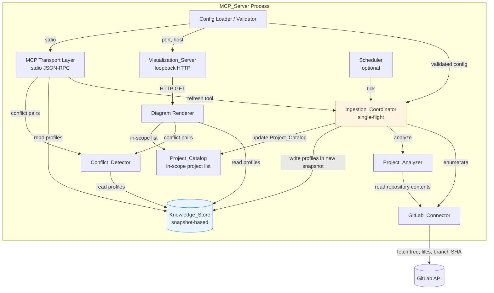
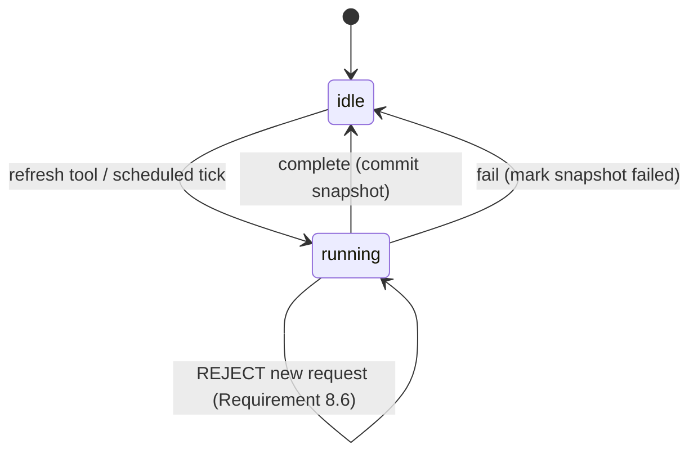
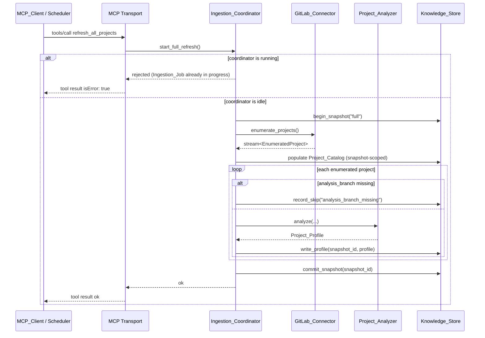
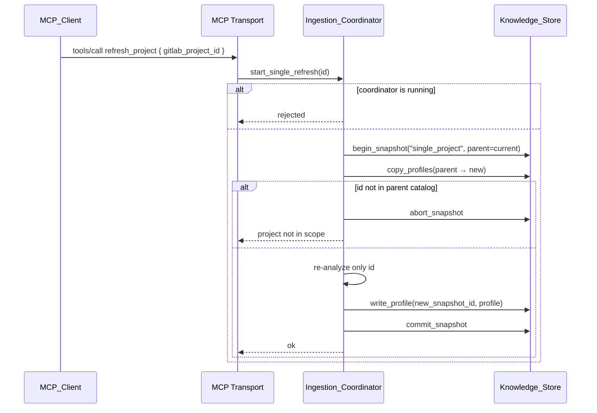
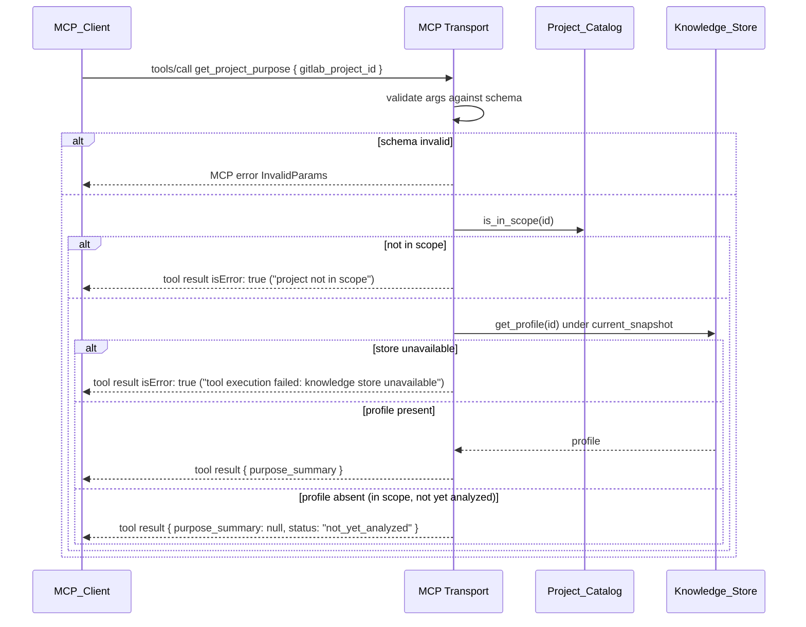
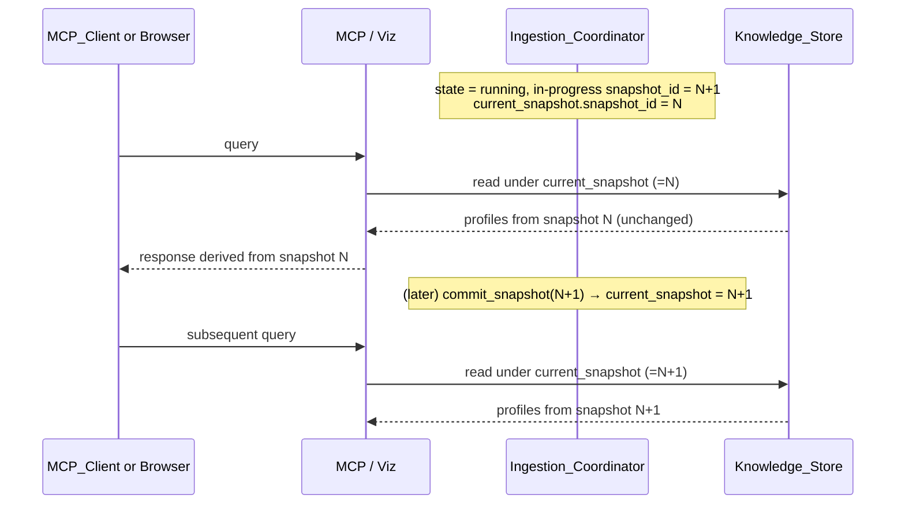

# Design Document

## Overview

The Project Knowledge MCP Server is a single-process system that ingests projects from a configured GitLab group, analyzes each project to derive a structured `Project_Profile`, persists those profiles in a `Knowledge_Store`, and exposes the resulting knowledge through two surfaces:

- An **MCP transport layer** (stdio) that serves agents via the Model Context Protocol with tools for querying purposes, inputs/outputs, dependencies, conflicts, and for triggering refreshes.
- A **Visualization_Server** (loopback HTTP) that serves a human-readable browser UI, rendering the same persisted `Project_Profile`s as Project_Profile, Dependency_Graph, and Conflict_Overview diagrams.

Both surfaces read from the *same* `Knowledge_Store` so that what an MCP client sees and what a human sees in the browser are always derived from the same persisted profiles (Requirement 14). Ingestion is performed by an `Ingestion_Job` that runs single-flight (Requirement 8.6) and only becomes visible to readers atomically on completion (Requirement 8.4 / 14.2).

The server is configured with a GitLab base URL, group path, access token, an `Analysis_Branch` (default `"uat"`, Requirement 15.2), an optional refresh interval, and an optional Visualization_Server TCP port (default `7345`, Requirement 12.4). Configuration is validated at startup and any failure terminates the process before either surface accepts traffic (Requirements 1.4, 1.5, 12.5, 12.6, 12.8, 15.6).

### Design Decisions and Rationale

- **Snapshot-based persistence with atomic commit.** The `Knowledge_Store` records `Project_Profile`s under a monotonically increasing `snapshot_id`. Ingestion writes profiles tagged with a *new* `snapshot_id`; readers always read from the latest *completed* snapshot. This satisfies Requirements 8.4 and 14.2 without requiring readers and writers to coordinate via locks, and avoids exposing partial state.
- **Single OS process.** Requirement 12.1 mandates that the Visualization_Server share the `Knowledge_Store` handle and lifecycle with the MCP_Server. Running them in the same process keeps the read path identical (Requirement 14.1) and simplifies shutdown ordering (Requirement 12.9).
- **Stdio for MCP, loopback HTTP for visualization.** Requirement 11.1 fixes stdio. Requirement 12.2 fixes loopback. The two transports are isolated from each other; each has its own request handlers but shares the `Knowledge_Store`, `Project_Catalog`, and `Conflict_Detector`.
- **Single-flight ingestion.** A single `Ingestion_Coordinator` enforces Requirement 8.6 with a process-wide mutex/state machine. The full-refresh tool, the single-project refresh tool, and the scheduled refresh all go through the same coordinator.

## Architecture

### Component Diagram



### Surface Boundaries

- **MCP transport** speaks JSON-RPC over stdin/stdout per the Model Context Protocol. It performs no business logic; it only validates request schemas, dispatches to internal services, and serializes results.
- **Visualization_Server** speaks HTTP over the loopback interface. It performs no analysis; it only reads from `Knowledge_Store`, runs the `Conflict_Detector`, asks the renderer for HTML, and returns the response.
- **Ingestion_Coordinator** is the only writer of `Project_Profile`s. Both surfaces are read-only with respect to profiles.

### Why a Snapshot Model

Requirement 8.4 says queries during an `Ingestion_Job` must return profiles persisted *before* the job started. A naive overwrite-in-place model violates this because partway through the job some profiles would be new and others stale. The snapshot model satisfies this by giving the `Ingestion_Job` a brand-new `snapshot_id` and only switching the "current" pointer on success. It also satisfies Requirement 14.2 for the visualization surface for free, since readers consult the same pointer.

## Components and Interfaces

This section describes each component's responsibility and the interface it exposes to other components. Interfaces are described in language-neutral terms; concrete signatures will be defined when the implementation language is chosen (see *Open Questions*).

### Config Loader / Validator

**Responsibility:** Read configuration from environment variables and/or a config file, normalize values, validate, and either return a validated `Config` or terminate the process with a named error message.

**Inputs read from configuration:**

| Key | Required | Default | Validation | Source Requirement |
|-----|----------|---------|------------|--------------------|
| `gitlab.base_url` | yes | — | non-empty string, valid URL | 1.1, 1.4 |
| `gitlab.group_path` | yes | — | non-empty string | 1.2, 1.4 |
| `gitlab.access_token` | yes | — | non-empty string | 1.3, 1.5 |
| `analysis.branch` | no | `"uat"` | non-empty string | 15.1, 15.2, 15.6 |
| `refresh.interval` | no | none (no schedule) | duration ≥ 1 minute | 8.3 |
| `visualization.port` | no | `7345` | integer in `[1, 65535]` | 12.3, 12.4, 12.5 |

**Behavior:** On any validation failure listed above, the loader writes a single error line to stderr that names the offending configuration key and the specific reason, then exits the process with a non-zero exit code. No surface (MCP or visualization) is started. This collapses Requirements 1.4, 1.5, 12.5, and 15.6 into one consistent failure mode.

### GitLab_Connector

**Responsibility:** Authenticate to the configured GitLab instance and provide enumeration and fetch operations for projects under the configured group on the configured `Analysis_Branch`.

**Interface:**

- `enumerate_projects() -> stream<EnumeratedProject>` — Yields every descendant repository of the configured group, paginated until exhausted (Requirements 2.1, 2.5). Each `EnumeratedProject` carries `gitlab_project_id`, `full_path`, `analysis_branch_name`, and `analysis_branch_commit_sha` (Requirements 2.2, 15.4). If the `Analysis_Branch` does not exist on a project, `analysis_branch_commit_sha` is `null` and a `branch_missing` flag is set so the analyzer can skip and the coordinator can record `"analysis_branch_missing"` (Requirement 15.5).
- `fetch_repository_contents(project_id, commit_sha) -> RepositoryContents` — Returns the file tree and accessor for individual files at the given commit. Used by the `Project_Analyzer`.

**Error handling:**

- HTTP 401/403 from any call during enumeration: raise `GitLabAuthError(status_code)`. The `Ingestion_Coordinator` catches this, both aborts the job and records the failure as a structured event; the abort and the report are performed in a single try/finally block that surfaces whichever fails (Requirement 2.3).
- HTTP 404 on the configured group: raise `GitLabGroupNotFoundError(group_path)`; the coordinator aborts the job and reports the error (Requirement 2.4).

### Project_Analyzer

**Responsibility:** Given a single project's `RepositoryContents`, produce a complete `Project_Profile`.

**Sub-analyzers:**

1. **Purpose summarizer** — Reads README files, GitLab repository description (passed in from enumeration), and source-code metadata such as package manifests (`package.json`, `pyproject.toml`, `pom.xml`, etc.) and module docstrings. Produces a string of at most 1000 characters (Requirement 3.4). If no source material yields content, produces `"unknown"` and records `reason = "insufficient source material"` (Requirement 3.3).
2. **I/O extractor** — Statically inspects code for HTTP route handlers, scheduled tasks, message consumers/publishers, file I/O, CLI entrypoints, and produces categorized `Abstract_Input` and `Abstract_Output` lists (Requirements 4.1–4.6). Categories are drawn from the closed sets defined in Requirements 4.3 and 4.4. Empty results are stored as empty lists (Requirements 4.5, 4.6).
3. **External service detector** — Detects calls to external services (HTTP clients with hard-coded base URLs, message broker clients, object-store SDKs, etc.). Deduplicates by service name and aggregates source locations (Requirement 5.3). Each entry has `name`, `kind` from the closed set in Requirement 5.2, and `source_locations` (list of file paths with optional line numbers).
4. **Database table detector** — Detects SQL table references in code, ORM models, and migrations. Aggregates by table name; if mixed access modes are detected, the entry's `access_mode` is set to `read_write` (Requirements 6.2, 6.3).

**Interface:** `analyze(project_id, full_path, analysis_branch, commit_sha, repo_description, repository_contents) -> Project_Profile`.

The analyzer never throws; if any sub-analyzer fails it records a `degraded` flag on the produced `Project_Profile` and continues with default empty values for the failing section. This allows the `Ingestion_Job` to make progress over a heterogeneous project portfolio.

### Knowledge_Store

**Responsibility:** Persist `Project_Profile`s atomically per snapshot, expose the latest committed snapshot to readers, and remain durable across restarts (Requirement 7).

**Conceptual schema:**

```
snapshots(
  snapshot_id        INTEGER PRIMARY KEY,
  started_at         TIMESTAMP NOT NULL,
  completed_at       TIMESTAMP NULL,
  status             TEXT NOT NULL,          -- 'in_progress' | 'completed' | 'failed'
  trigger            TEXT NOT NULL,          -- 'full' | 'single_project' | 'scheduled' | 'startup_load'
  parent_snapshot_id INTEGER NULL            -- for single-project refreshes that copy from prior
)

project_profiles(
  snapshot_id              INTEGER NOT NULL REFERENCES snapshots,
  gitlab_project_id        INTEGER NOT NULL,
  full_path                TEXT NOT NULL,
  analysis_branch          TEXT NOT NULL,
  analysis_branch_sha      TEXT NULL,        -- NULL if branch was missing on this project
  produced_at              TIMESTAMP NOT NULL,
  profile_json             JSON NOT NULL,    -- the full Project_Profile payload
  PRIMARY KEY (snapshot_id, gitlab_project_id)
)

ingestion_skips(
  snapshot_id        INTEGER NOT NULL REFERENCES snapshots,
  gitlab_project_id  INTEGER NOT NULL,
  reason             TEXT NOT NULL,          -- e.g. 'analysis_branch_missing'
  detail             TEXT NULL
)

current_snapshot(
  snapshot_id        INTEGER REFERENCES snapshots
)
-- single-row table (or KV entry) holding the snapshot_id readers see.
```

**Interface for writers (Ingestion_Coordinator only):**

- `begin_snapshot(trigger, parent_snapshot_id?) -> snapshot_id`
- `write_profile(snapshot_id, profile, produced_at, commit_sha)` — replaces any existing entry for that `(snapshot_id, gitlab_project_id)`.
- `record_skip(snapshot_id, gitlab_project_id, reason, detail)`
- `commit_snapshot(snapshot_id)` — atomically updates `current_snapshot.snapshot_id`. Only after this returns are readers exposed to the snapshot.
- `abort_snapshot(snapshot_id)` — marks the snapshot `failed`. The `current_snapshot` pointer is unchanged.

**Interface for readers (MCP tools, Visualization_Server):**

- `get_current_snapshot_id() -> snapshot_id | null`
- `get_profile(gitlab_project_id) -> Project_Profile | null` — looks up under the current snapshot.
- `list_profiles() -> list<Project_Profile>` — all profiles in the current snapshot.
- `get_snapshot_metadata() -> SnapshotMetadata | null` — the `started_at`, `completed_at`, `trigger`, and `commit SHA` per project.

**Atomicity:** All writes during a single `Ingestion_Job` are tagged with that job's `snapshot_id`. Readers never observe partial state because they read only via `current_snapshot.snapshot_id`, which is updated in a single transactional step at the end of the job (Requirements 8.4, 14.2).

**Single-project refresh:** `begin_snapshot("single_project", parent=current_snapshot_id)` first copies all profile rows from the parent snapshot into the new snapshot, then the coordinator overwrites only the targeted project. On `commit_snapshot`, all other profiles remain identical, but the pointer moves forward.

**Store-unavailable behavior:** If the underlying storage cannot be read (file locked, disk error, etc.) while a reader is handling a request, the read interface raises `KnowledgeStoreUnavailableError`. The MCP layer translates this to a tool execution failure (Requirement 11.7); the visualization layer translates it to HTTP 503 (Requirement 14.6). Cached/in-memory profile data is never used as a fallback.

### Project_Catalog

**Responsibility:** Maintain the list of in-scope projects from the most recent enumeration (independent of whether each project has a successfully analyzed profile). This separation is necessary because Requirement 14.3 distinguishes "in-scope but not yet analyzed" from "out of scope" (Requirement 14.5). Without a catalog, there is no way to answer that distinction.

**Implementation:** A small table populated at the start of each `Ingestion_Job` from the `GitLab_Connector` enumeration step, before any analysis. The catalog is also snapshot-scoped so it changes atomically.

**Interface:**
- `list_in_scope() -> list<{gitlab_project_id, full_path}>`
- `is_in_scope(gitlab_project_id) -> bool`

### Conflict_Detector

**Responsibility:** Given two `Project_Profile`s (or all of them), classify pairs as having a `Purpose_Conflict`, `no_conflict`, or `indeterminate`, with a justification string.

**Interface:**

- `classify_pair(profile_a, profile_b) -> ConflictResult` where `ConflictResult = { kind: "conflict" | "no_conflict" | "indeterminate", justification: string }`.
- `find_all_conflicts(profiles) -> list<{project_id_a, project_id_b, justification}>`

**Classification logic (Requirements 9.3, 9.4):**

1. If either profile's purpose summary is `"unknown"`, return `indeterminate` with a justification stating that the purpose summary is unknown for the named project(s).
2. Otherwise, compare the two purpose summaries for substantial overlap of *primary responsibility* or for *contradictory ownership* of the same responsibility. The detector uses a deterministic heuristic (token overlap + canonical responsibility extraction; see Open Questions on whether to use an LLM here). If neither condition holds, return `no_conflict`.
3. The classifier MUST NOT return `conflict` for any other reason (Requirement 9.3).

The `find_all_conflicts` method is symmetric and unordered: it returns at most one entry per unordered pair `{a, b}`, never both `(a, b)` and `(b, a)`.

### MCP Transport Layer

**Responsibility:** Implement the MCP server role over stdio (Requirement 11.1) and dispatch tool calls.

**Lifecycle:**
1. On startup (after config validation and `Knowledge_Store` opening), bind to stdin/stdout and wait for an `initialize` request.
2. On `initialize`, respond with `{ name, version, capabilities: { tools: {} } }` (Requirement 11.2).
3. On `tools/list`, respond with the tool list defined below — but only when explicitly requested; the server never sends an unsolicited `tools/list` response (Requirement 11.3).
4. On `tools/call`, validate arguments against the tool's input schema, dispatch to the handler, and return either a tool result or an MCP error.

**Tools exposed:**

| Tool name | Description | Source Requirement |
|-----------|-------------|--------------------|
| `list_projects` | Returns all in-scope projects with `gitlab_project_id` and `full_path`. | 10.6 |
| `get_project_purpose` | Args: `gitlab_project_id`. Returns purpose summary. | 10.1 |
| `get_project_io` | Args: `gitlab_project_id`. Returns `Abstract_Inputs` and `Abstract_Outputs`. | 10.2 |
| `get_project_dependencies` | Args: `gitlab_project_id`. Returns `External_Service_Dependencies` and `Database_Table_Dependencies`. | 10.3 |
| `get_project_profile` | Args: `gitlab_project_id`. Returns the full `Project_Profile`. | 10.5 |
| `list_purpose_conflicts` | No args. Returns all `Purpose_Conflict` pairs. | 10.4 |
| `refresh_all_projects` | No args. Triggers an `Ingestion_Job` for all in-scope projects. | 8.1 |
| `refresh_project` | Args: `gitlab_project_id`. Triggers an `Ingestion_Job` for a single project. | 8.2 |

**Error mapping:**

- Unknown tool → MCP error code `MethodNotFound` with `message: "tool '{name}' is unknown"` (Requirement 11.5).
- Argument validation failure → MCP error code `InvalidParams` with a `data` object listing `{ argument, rule }` (Requirement 11.6).
- Project not in scope → tool result with `isError: true` and message naming the project ID (Requirement 10.7).
- Internal runtime/dependency failure (e.g. `KnowledgeStoreUnavailableError`, `GitLabAuthError`) → tool result with `isError: true` and a message of the form `"tool execution failed: {reason}"` (Requirement 11.7).
- Refresh requested while another `Ingestion_Job` is running → tool result with `isError: true` and message stating an `Ingestion_Job` is already in progress (Requirement 8.6).

### Ingestion_Coordinator

**Responsibility:** Orchestrate `Ingestion_Job`s. Enforce single-flight. Translate failures into structured events. Update `Knowledge_Store` and `Project_Catalog` atomically.

**State machine:**

```
idle ──start──▶ running ──complete──▶ idle
                  │
                  └──fail──▶ idle  (snapshot marked 'failed', current_snapshot pointer unchanged)
```

The `running` state holds the current `snapshot_id`, the trigger (`full | single_project | scheduled`), and the start timestamp. Any attempt to start a new job while `running` is rejected with the message defined for Requirement 8.6.

**Job procedure (full refresh):**

1. CAS `idle → running` with a fresh `snapshot_id`. If the CAS fails, return `already_in_progress`.
2. Call `GitLab_Connector.enumerate_projects()`. On `GitLabAuthError` or `GitLabGroupNotFoundError`, mark the snapshot `failed`, set state back to `idle`, and surface the error (Requirements 2.3, 2.4).
3. Populate the new snapshot's `Project_Catalog` with the enumeration result.
4. For each enumerated project:
   - If `analysis_branch_commit_sha` is `null`, call `record_skip(reason="analysis_branch_missing", detail=...)` and continue (Requirement 15.5).
   - Otherwise, call `Project_Analyzer.analyze(...)` and `Knowledge_Store.write_profile(...)`.
5. Call `Knowledge_Store.commit_snapshot(snapshot_id)`. This is the single moment readers transition.
6. Set state to `idle`.

**Job procedure (single-project refresh):**

1. CAS `idle → running` with a fresh `snapshot_id` whose `parent_snapshot_id` is the current committed snapshot.
2. Copy all rows from the parent snapshot into the new snapshot (catalog + profiles).
3. Re-run analysis only for the requested `gitlab_project_id`. If the project is not in the parent's catalog, mark snapshot `failed` and surface "project not in scope".
4. Commit and return to `idle`.

**Scheduled refresh:** A scheduler component triggers `refresh_all_projects` every `refresh.interval`. If the previous job is still `running` when the timer fires, the new request is rejected per Requirement 8.6 and a log line is emitted. The next tick is scheduled regardless.

### Visualization_Server

**Responsibility:** Serve the four HTML routes defined by Requirement 13 from the loopback interface only. Read all data through the `Knowledge_Store`, `Project_Catalog`, and `Conflict_Detector` interfaces (Requirement 14.1).

**Binding:**
- Listens on both `127.0.0.1` and `::1` only (Requirement 12.2).
- Configurable port (default `7345`).
- Startup binds before declaring readiness; failure to bind for any reason terminates the MCP_Server process per Requirements 12.5, 12.6, 12.8.

**Routes:**

| Method + Path | Handler | Source Requirement |
|---------------|---------|--------------------|
| `GET /` | Index page listing in-scope projects ordered by `gitlab_project_id` ascending, with links to per-project, dependency, and conflict diagrams. Empty-state message when no in-scope projects. | 13.1, 14.4 |
| `GET /projects/{project_id}` (digits only) | Project_Profile_Diagram for that project. Empty-state per section if any of `Abstract_Inputs`, `Abstract_Outputs`, `External_Service_Dependencies`, `Database_Table_Dependencies` is empty. "Not yet analyzed" message if in-scope but no profile. 404 if not in scope. | 13.2, 13.6, 14.3, 14.5 |
| `GET /dependencies` | Dependency_Graph_Diagram. Edges: `shared external service: {service_name}` and `shared table: {table_name}`. Empty-state message when no shared deps. | 13.3, 14.4 |
| `GET /conflicts` | Conflict_Overview_Diagram with edges labeled by justification. Empty-state message when no conflicts. | 13.4, 14.4 |
| `GET /<other>` | 404 HTML page including the requested path. | 13.7 |
| `<non-GET> /` etc. | 405 with `Allow: GET`. | 13.8 |

All HTML responses use `Content-Type: text/html; charset=utf-8` (Requirement 13.5). Each handler reads the current snapshot from `Knowledge_Store` *at request time*, with no in-process caching of profile data (Requirement 14.1). Responses begin within 5 seconds, enforced by a request-handler-level deadline (Requirement 13.9).

**Store-unavailable response:** If `Knowledge_Store` reads raise `KnowledgeStoreUnavailableError`, the handler returns HTTP 503 with an HTML page stating that project knowledge is temporarily unavailable. No cached data is used (Requirement 14.6).

### Diagram Renderer

**Responsibility:** Convert profiles, catalog, and conflict pairs into HTML.

- **Project_Profile_Diagram:** Renders purpose summary, then four sections for inputs/outputs/external services/db tables. Each section either lists entries (grouped by category for I/O, labeled by service kind for external services, labeled by access mode for db tables) or shows a section-specific empty-state message naming the section.
- **Dependency_Graph_Diagram:** Computes shared dependencies by intersecting `External_Service_Dependencies` and `Database_Table_Dependencies` across project pairs. Emits a graph (e.g. inline SVG via Mermaid or a server-rendered HTML/SVG layout) with one node per in-scope project and one edge per shared dependency. Always renders nodes for in-scope projects even when no edges exist.
- **Conflict_Overview_Diagram:** Emits a graph with one node per in-scope project and one edge per `Purpose_Conflict`, edge label = justification.

The renderer is a pure function from `(catalog, profiles, conflict_pairs)` to HTML; it has no I/O of its own.

## Data Models

### Project_Profile

```
Project_Profile {
  gitlab_project_id           : integer        // GitLab project ID, primary key
  full_path                   : string         // e.g. "group/subgroup/project"
  analysis_branch             : string         // value used for this profile
  analysis_branch_commit_sha  : string         // commit SHA the profile was derived from
  produced_at                 : timestamp      // when analysis completed
  purpose_summary             : string         // <= 1000 chars, or "unknown"
  purpose_summary_reason      : string | null  // e.g. "insufficient source material" when "unknown"
  abstract_inputs             : list<Abstract_Input>
  abstract_outputs            : list<Abstract_Output>
  external_service_dependencies : list<External_Service_Dependency>
  database_table_dependencies   : list<Database_Table_Dependency>
  degraded_sections           : list<string>   // names of sub-analyzers that failed; empty when all OK
}

Abstract_Input {
  category    : enum { http_request, scheduled_event, message_consumed, file_read, cli_argument, other }
  description : string
}

Abstract_Output {
  category    : enum { http_response, message_published, file_written, database_write, external_call, other }
  description : string
}

External_Service_Dependency {
  name             : string
  kind             : enum { http_api, message_broker, object_store, cache, auth_provider, other }
  source_locations : list<SourceLocation>      // non-empty
}

Database_Table_Dependency {
  table_name       : string
  access_mode      : enum { read, write, read_write }
  source_locations : list<SourceLocation>      // non-empty
}

SourceLocation {
  path : string
  line : integer | null
}
```

**Invariants on Project_Profile:**

- `len(purpose_summary) <= 1000` (Requirement 3.4).
- If `purpose_summary == "unknown"`, then `purpose_summary_reason` is non-null.
- `external_service_dependencies` contains at most one entry per `name` (Requirement 5.3).
- `database_table_dependencies` contains at most one entry per `table_name`. If multiple access modes were detected, `access_mode` is `read_write` (Requirement 6.3).
- `analysis_branch` matches the configured `Analysis_Branch` (Requirement 15.4).

### Ingestion Metadata (Snapshot)

```
Snapshot {
  snapshot_id        : integer
  started_at         : timestamp
  completed_at       : timestamp | null
  status             : enum { in_progress, completed, failed }
  trigger            : enum { full, single_project, scheduled, startup_load }
  parent_snapshot_id : integer | null          // set for single_project refresh
}

Skip {
  snapshot_id       : integer
  gitlab_project_id : integer
  reason            : string                   // e.g. "analysis_branch_missing"
  detail            : string | null
}

CurrentSnapshot {
  snapshot_id : integer | null                 // null until first successful Ingestion_Job
}
```

**Visibility rule:** A `Project_Profile` is visible to readers if and only if its `snapshot_id` equals `CurrentSnapshot.snapshot_id`. `CurrentSnapshot.snapshot_id` is updated only by `commit_snapshot` and only when the snapshot's status transitions to `completed`.

## Process and Lifecycle

### Startup

1. Load configuration. On any missing/invalid value as listed in the Config table, write the named error to stderr and exit. (Requirements 1.4, 1.5, 12.5, 15.6.)
2. Open `Knowledge_Store`. If a previously committed snapshot exists, leave it as the current snapshot so MCP queries can be served immediately (Requirement 7.2). If no snapshot exists, `CurrentSnapshot.snapshot_id` is `null`.
3. Construct the `Ingestion_Coordinator` in the `idle` state.
4. Bind the `Visualization_Server` to the configured port on `127.0.0.1` and `::1`. On bind failure, exit with the appropriate error message:
   - port already in use → "port {port} is already in use" (Requirement 12.6),
   - other OS/runtime errors → underlying reason (Requirement 12.8).
5. Emit a log line `"Visualization_Server ready at http://127.0.0.1:{port}"` (Requirement 12.7).
6. Bind the MCP transport to stdin/stdout and start serving.
7. Start the scheduler if `refresh.interval` is configured.

If steps 1, 2, or 4 fail, neither surface accepts traffic.

### Ingestion Job Lifecycle



While in `running`, any reader continues to use the snapshot pointer that was current when the job started. Writers (only the coordinator) tag their writes with the new in-progress `snapshot_id`. Only `commit_snapshot` makes those writes visible.

### Shutdown

1. Visualization_Server stops accepting new HTTP connections (Requirement 12.9).
2. In-flight HTTP responses are allowed to complete (subject to a short grace period).
3. The MCP transport closes its stdio handlers.
4. Any in-progress `Ingestion_Job` is signaled to abort. The coordinator marks its snapshot `failed`. The current snapshot pointer is unchanged so the next startup serves the last successful snapshot.
5. `Knowledge_Store` is flushed and closed.
6. Process exits.

## Sequence Flows

### Full Refresh



### Single-Project Refresh



### MCP Query (e.g. get_project_purpose)



### Visualization Request (GET /projects/{id})

```mermaid
sequenceDiagram
    participant Browser
    participant Viz as Visualization_Server
    participant Catalog as Project_Catalog
    participant Store as Knowledge_Store
    participant Render as Diagram Renderer

    Browser->>Viz: GET /projects/12345
    alt method != GET
        Viz-->>Browser: 405 Allow: GET
    else path doesn't match a route
        Viz-->>Browser: 404 HTML naming the path
    else
        Viz->>Catalog: is_in_scope(12345)
        alt not in scope
            Viz-->>Browser: 404 HTML "Project 12345 is not in scope"
        else in scope
            Viz->>Store: get_profile(12345) under current_snapshot
            alt store unavailable
                Viz-->>Browser: 503 HTML
            else no profile yet
                Viz-->>Browser: 200 HTML "not yet analyzed; run an Ingestion_Job"
            else profile present
                Viz->>Render: render_profile_diagram(profile)
                Render-->>Viz: HTML
                Viz-->>Browser: 200 HTML (Content-Type: text/html; charset=utf-8)
            end
        end
    end
```

### Query While Ingestion Is In Progress




## Correctness Properties

*A property is a characteristic or behavior that should hold true across all valid executions of a system — essentially, a formal statement about what the system should do. Properties serve as the bridge between human-readable specifications and machine-verifiable correctness guarantees.*

The following correctness properties are derived from the testability prework over Requirements 1–15. Each property is universally quantified, references the requirements it validates, and is intended to be implemented as a single property-based test in the test plan.

### Property 1: Required configuration is validated at startup

*For all* configurations in which any of `gitlab.base_url`, `gitlab.group_path`, `gitlab.access_token`, `analysis.branch` (when present), or `visualization.port` (when present) is missing, empty when not allowed, or otherwise outside its declared validation rule, the MCP_Server SHALL fail startup before either surface accepts traffic, emit an error message that names the offending configuration key, and terminate the process.

**Validates: Requirements 1.4, 1.5, 12.5, 15.6**

### Property 2: Enumeration covers every descendant project across all pages

*For all* group trees (any nesting depth, any number of subgroups, any per-page count from a paginated GitLab API), the `GitLab_Connector.enumerate_projects()` result SHALL equal exactly the set of projects that are descendants of the configured group, with no duplicates and no omissions.

**Validates: Requirements 2.1, 2.5**

### Property 3: Every enumerated project has full identity and Analysis_Branch metadata recorded

*For all* enumerated projects produced by an `Ingestion_Job`, the `EnumeratedProject` record SHALL contain a non-null `gitlab_project_id`, `full_path`, `analysis_branch_name` equal to the configured `Analysis_Branch`, and (where the branch exists on the project) `analysis_branch_commit_sha`.

**Validates: Requirements 2.2, 15.4**

### Property 4: Purpose summaries are bounded in length

*For all* repositories, the `purpose_summary` produced by the `Project_Analyzer` SHALL be at most 1000 characters long.

**Validates: Requirements 3.4**

### Property 5: Insufficient source material yields the canonical "unknown" result

*For all* repositories that have no README, no GitLab repository description, and no analyzable source-code metadata containing content from which a purpose summary could be derived, the `Project_Analyzer` SHALL produce `purpose_summary == "unknown"` and `purpose_summary_reason == "insufficient source material"`.

**Validates: Requirements 3.3**

### Property 6: Every analyzed Project_Profile has well-formed list-shaped sections

*For all* analyzed projects, the produced `Project_Profile` SHALL satisfy:
- `abstract_inputs` is a list (possibly empty) where every entry has `category` in `{http_request, scheduled_event, message_consumed, file_read, cli_argument, other}` and a non-null `description`,
- `abstract_outputs` is a list (possibly empty) where every entry has `category` in `{http_response, message_published, file_written, database_write, external_call, other}` and a non-null `description`,
- `external_service_dependencies` is a list (possibly empty) where every entry has a non-empty `name`, `kind` in `{http_api, message_broker, object_store, cache, auth_provider, other}`, and a non-empty `source_locations` list,
- `database_table_dependencies` is a list (possibly empty) where every entry has a non-empty `table_name`, `access_mode` in `{read, write, read_write}`, and a non-empty `source_locations` list.

**Validates: Requirements 3.1, 4.1, 4.2, 4.3, 4.4, 4.5, 4.6, 5.1, 5.2, 5.4, 6.1, 6.2, 6.4**

### Property 7: External service dependencies are deduplicated by name

*For all* repositories, the produced `external_service_dependencies` list SHALL contain at most one entry per service `name`, and the union of `source_locations` across that single entry SHALL equal the set of source locations from which the service was detected in the repository.

**Validates: Requirements 5.3**

### Property 8: Mixed-mode access on a single table is recorded as read_write

*For all* repositories where a single table is accessed from multiple source locations with both `read` and `write` access modes, the produced `database_table_dependencies` entry for that table SHALL have `access_mode == "read_write"`.

**Validates: Requirements 6.3**

### Property 9: Profile writes within a snapshot round-trip and last-write-wins

*For all* sequences of `write_profile` operations within a single snapshot, for every `gitlab_project_id` that received at least one write, `get_profile(gitlab_project_id)` SHALL return the value of the most recent write (after the snapshot is committed and made current), and the persisted record SHALL include `produced_at` and `analysis_branch_commit_sha`.

**Validates: Requirements 7.1, 7.3, 7.4**

### Property 10: Persisted profiles survive restart

*For all* sequences `write* → commit → close → reopen → read*`, the values returned by reads after reopen SHALL equal the values written before the close, drawn from the last successfully committed snapshot.

**Validates: Requirements 7.2**

### Property 11: Snapshot isolation governs all reads

*For all* sequences of `(begin_snapshot, partial_write*, commit_or_abort)` operations and any read issued at any point in the sequence, the read result SHALL equal the result of reading from the snapshot that was current immediately before the most recent unfinished `begin_snapshot` (if any) or the most recent committed snapshot otherwise; readers SHALL never observe partial writes from an in-progress `Ingestion_Job`, and the Visualization_Server's diagram inputs SHALL be read from the `Knowledge_Store` at the moment the HTTP request is handled, with no in-memory caching.

**Validates: Requirements 8.4, 8.5, 14.1, 14.2**

### Property 12: At most one Ingestion_Job runs at a time

*For all* sequences of refresh requests (full or single-project, from MCP tools or the scheduler), at most one `Ingestion_Job` is in the `running` state at any moment; every refresh request issued while another job is running SHALL be rejected with the documented "Ingestion_Job already in progress" message and SHALL leave the coordinator state and the `Knowledge_Store` unchanged; every refresh request issued while the coordinator is `idle` SHALL be accepted.

**Validates: Requirements 8.6**

### Property 13: Conflict pair classification has a valid shape

*For all* pairs of `Project_Profile`s, `Conflict_Detector.classify_pair` SHALL return a result whose `kind` is one of `{conflict, no_conflict, indeterminate}` and whose `justification` is a non-empty string referencing the purpose summaries that led to the classification.

**Validates: Requirements 9.1**

### Property 14: Full-set conflict detection equals the symmetric closure of pair classification

*For all* sets of `Project_Profile`s, `Conflict_Detector.find_all_conflicts(profiles)` SHALL return exactly the set of unordered pairs `{a, b}` (with `a != b`) such that `classify_pair(a, b).kind == "conflict"`, with each unordered pair represented at most once.

**Validates: Requirements 9.2**

### Property 15: Purpose conflicts are only classified on the allowed basis

*For all* pairs of `Project_Profile`s where `classify_pair(a, b).kind == "conflict"`, neither `a.purpose_summary` nor `b.purpose_summary` equals `"unknown"`, and the documented justification SHALL describe either substantially the same primary responsibility or contradictory ownership of the same responsibility; the classifier SHALL never return `conflict` on any other basis.

**Validates: Requirements 9.3**

### Property 16: An unknown purpose summary forces an indeterminate result

*For all* pairs of `Project_Profile`s where at least one purpose summary equals `"unknown"`, `classify_pair(a, b)` SHALL return a result with `kind == "indeterminate"` and a justification stating that the purpose summary is unknown for the named project(s).

**Validates: Requirements 9.4**

### Property 17: Project-id-typed MCP tools reject out-of-scope IDs

*For all* MCP tools that accept a `gitlab_project_id` argument and any `gitlab_project_id` value not present in the current `Project_Catalog`, `tools/call` SHALL return a tool result with `isError: true` whose message states that the project is not in scope.

**Validates: Requirements 10.7**

### Property 18: tools/list responses are solicited and complete

*For all* MCP sessions, the count of `tools/list` responses sent by the MCP_Server SHALL equal the count of `tools/list` requests received from the MCP_Client; every such response SHALL contain exactly the tool set defined by Requirements 8 and 10 with each tool's input schema.

**Validates: Requirements 11.3**

### Property 19: tools/call dispatch is correct across happy paths and failure modes

*For all* `tools/call` requests, the response SHALL satisfy:
- if the tool name is in the defined set and arguments validate, the response is a tool result produced by the tool's handler,
- if the tool name is not in the defined set, the response is an MCP error response indicating the tool is unknown,
- if arguments fail input-schema validation, the response is an MCP error response that names the failing argument and the validation rule that failed,
- if the handler raises a runtime or external-dependency failure, the response is a tool result with `isError: true` whose message names the failure reason.

**Validates: Requirements 11.4, 11.5, 11.6, 11.7**

### Property 20: Visualization_Server binds only to the loopback interface

*For all* network interface addresses, the Visualization_Server SHALL accept HTTP connections on `127.0.0.1` and `::1` and SHALL NOT accept HTTP connections on any other address.

**Validates: Requirements 12.2**

### Property 21: GET / response shape

*For all* `Project_Catalog` states (including empty), `GET /` SHALL return HTTP 200 with an HTML body that:
- if the catalog is non-empty and a snapshot is current, contains exactly one list entry per in-scope project ordered by `gitlab_project_id` ascending, where each entry includes the project's ID, full path, a link to its `Project_Profile_Diagram`, a link to the Dependency_Graph_Diagram, and a link to the Conflict_Overview_Diagram,
- if the catalog is empty, contains the empty-state message "No Projects are in scope" and no per-project list entries,
- if no `Ingestion_Job` has ever completed, contains the "no project knowledge available; run an Ingestion_Job" message and no diagram content.

**Validates: Requirements 13.1, 14.4**

### Property 22: GET /projects/{project_id} response shape

*For all* digit-only `project_id` values, `GET /projects/{project_id}` SHALL return:
- HTTP 200 with a `Project_Profile_Diagram` rendering the project's purpose summary, `Abstract_Inputs` grouped by category, `Abstract_Outputs` grouped by category, `External_Service_Dependencies` labeled by service kind, `Database_Table_Dependencies` labeled by access mode, and a section-specific empty-state message naming each empty section, when the project is in scope and a profile is persisted,
- HTTP 200 with a "Project has not yet been analyzed; run an Ingestion_Job" message and no `Project_Profile_Diagram`, when the project is in scope but no profile is persisted,
- HTTP 404 with HTML stating the project is not in scope and including the requested `project_id` value, when the project is not in scope.

**Validates: Requirements 13.2, 13.6, 14.3, 14.5**

### Property 23: GET /dependencies response shape

*For all* sets of persisted `Project_Profile`s, `GET /dependencies` SHALL return HTTP 200 with a `Dependency_Graph_Diagram` whose node set equals the in-scope `Project_Catalog` and whose edge set equals exactly the set of unordered pairs `{a, b}` for which:
- `a` and `b` share an `External_Service_Dependency` `name` (each shared service name produces one edge labeled `"shared external service: {service_name}"`), or
- `a` and `b` share a `Database_Table_Dependency` `table_name` (each shared table produces one edge labeled `"shared table: {table_name}"`).

When no two projects share any dependency, the response SHALL include a visible message stating that no shared dependencies were detected, while still rendering the project nodes (or the empty-state message if the catalog is empty). When no `Ingestion_Job` has ever completed, the response SHALL show the "no knowledge available" message and no diagram.

**Validates: Requirements 13.3, 14.4**

### Property 24: GET /conflicts response shape

*For all* sets of persisted `Project_Profile`s, `GET /conflicts` SHALL return HTTP 200 with a `Conflict_Overview_Diagram` whose node set equals the in-scope `Project_Catalog` and whose edge set equals exactly `Conflict_Detector.find_all_conflicts(profiles)`, with each edge labeled by the `Purpose_Conflict` justification string. When the conflict set is empty, the response SHALL include a visible message stating that no purpose conflicts were detected, while still rendering the project nodes (or the empty-state message if the catalog is empty). When no `Ingestion_Job` has ever completed, the response SHALL show the "no knowledge available" message and no diagram.

**Validates: Requirements 13.4, 14.4**

### Property 25: All Project_Knowledge_Diagram responses use a fixed Content-Type

*For all* HTTP 200 responses from the four Visualization_Server diagram routes (`/`, `/projects/{project_id}`, `/dependencies`, `/conflicts`), the `Content-Type` response header SHALL equal exactly `"text/html; charset=utf-8"`.

**Validates: Requirements 13.5**

### Property 26: Unknown paths produce a 404 with the requested path in the body

*For all* HTTP GET request paths that do not match `/`, `/projects/{digits}`, `/dependencies`, or `/conflicts`, the Visualization_Server SHALL respond with HTTP 404 and an HTML body that includes the requested path verbatim and that states the requested page does not exist.

**Validates: Requirements 13.7**

### Property 27: Non-GET methods on diagram routes produce a 405 with Allow: GET

*For all* HTTP methods other than GET against any of the routes `/`, `/projects/{digits}`, `/dependencies`, `/conflicts`, the Visualization_Server SHALL respond with HTTP 405 and an `Allow` header whose value is exactly the string `"GET"`.

**Validates: Requirements 13.8**

### Property 28: Knowledge_Store-unavailable yields 503 across all diagram routes

*For all* HTTP GET requests to `/`, `/projects/{project_id}` (digit-only), `/dependencies`, or `/conflicts` issued while `Knowledge_Store` reads raise `KnowledgeStoreUnavailableError`, the Visualization_Server SHALL respond with HTTP 503 and an HTML body stating that project knowledge is temporarily unavailable, and SHALL NOT include any `Project_Profile`-derived content drawn from caches or in-memory state.

**Validates: Requirements 14.6**

### Property 29: Ingestion fetches and records the configured Analysis_Branch

*For all* `Ingestion_Job`s and all in-scope projects, the `GitLab_Connector` SHALL fetch repository contents from the configured `Analysis_Branch` regardless of the project's GitLab default branch, and the resulting `Project_Profile` (when produced) SHALL record `analysis_branch` equal to the configured value and `analysis_branch_commit_sha` equal to the most recent commit SHA on that branch.

**Validates: Requirements 15.3, 15.4**

### Property 30: Missing Analysis_Branch on a project causes a skip and lets the job continue

*For all* `Ingestion_Job`s where the configured `Analysis_Branch` does not exist on a subset `S` of in-scope projects, the job SHALL:
- not produce a `Project_Profile` for any project in `S`,
- record a `Skip` entry for every project in `S` with `reason == "analysis_branch_missing"` and a `detail` that names both the configured `Analysis_Branch` value and the project's `gitlab_project_id`,
- continue to attempt analysis for every other in-scope project not in `S`.

**Validates: Requirements 15.5**

## Error Handling

This section maps each error condition raised by Requirements 1–15 to a concrete handling strategy and to the surface that observes it.

### Startup errors (process-terminating)

The MCP_Server treats these conditions as fatal and exits before either surface accepts traffic. The error message is written to stderr in a single line and names the offending configuration key.

| Condition | Source | Message format | Requirement |
|-----------|--------|----------------|-------------|
| `gitlab.base_url` missing | Config | `startup error: configuration value 'gitlab.base_url' is required` | 1.4 |
| `gitlab.group_path` missing | Config | `startup error: configuration value 'gitlab.group_path' is required` | 1.4 |
| `gitlab.access_token` missing | Config | `startup error: configuration value 'gitlab.access_token' is required` | 1.5 |
| `analysis.branch` is empty string | Config | `startup error: configuration value 'analysis.branch' must not be empty` | 15.6 |
| `visualization.port` is not an integer | Config | `startup error: configuration value 'visualization.port' must be an integer` | 12.5 |
| `visualization.port` outside [1, 65535] | Config | `startup error: configuration value 'visualization.port' must be in the range 1 to 65535` | 12.5 |
| `visualization.port` already in use | Bind | `startup error: visualization.port {port} is already in use` | 12.6 |
| Other Visualization_Server bind failure | Bind | `startup error: visualization server failed to start: {os_error}` | 12.8 |

In every case the process exits with a non-zero exit code. No partial startup state is left behind.

### Ingestion errors (job-terminating but server keeps running)

These errors abort the in-progress `Ingestion_Job` and mark its snapshot `failed`. The `current_snapshot.snapshot_id` pointer is unchanged, so readers continue to see the last successful snapshot. The error is reported to whichever caller triggered the job (MCP `tools/call` result with `isError: true`, scheduler log line).

| Condition | Component | Behavior | Requirement |
|-----------|-----------|----------|-------------|
| GitLab returns 401/403 during enumeration | GitLab_Connector | Abort the job AND report `auth failure: status {code}`, both performed in a single try/finally block; if either step itself fails, surface the underlying failure rather than completing only one step | 2.3 |
| GitLab returns 404 on configured group | GitLab_Connector | Abort the job and report `group not found: {group_path}` | 2.4 |
| Analysis_Branch missing on a project | Ingestion_Coordinator | Skip that project (record `analysis_branch_missing`), continue with remaining projects | 15.5 |
| Project_Analyzer sub-analyzer raises | Project_Analyzer | Record the section in `degraded_sections`, continue with default empty values for that section | (defensive; supports 4.5/4.6/5.4/6.4) |

### Concurrent ingestion request

| Condition | Behavior | Requirement |
|-----------|----------|-------------|
| Refresh requested while another job is running | Reject the new request with the message `"Ingestion_Job is already in progress"`. Coordinator state and Knowledge_Store are unchanged. From an MCP `tools/call` this surfaces as a tool result with `isError: true`; from the scheduler this surfaces as a log line; the next scheduler tick is still scheduled. | 8.6 |

### MCP layer errors

| Condition | Response shape | Requirement |
|-----------|----------------|-------------|
| `tools/call` for unknown tool | MCP error response indicating the tool is unknown (e.g. JSON-RPC error code `MethodNotFound` with `message: "tool '{name}' is unknown"`) | 11.5 |
| `tools/call` arguments fail schema validation | MCP error response (e.g. `InvalidParams`) whose `data` field names the failing argument and the validation rule that failed | 11.6 |
| `tools/call` runtime/dependency failure | Tool result with `isError: true`, message `"tool execution failed: {reason}"`; reason names the underlying error class (e.g. `KnowledgeStoreUnavailableError`, `GitLabAuthError`) | 11.7 |
| `tools/call` for project-id-typed tool with out-of-scope ID | Tool result with `isError: true`, message `"project {gitlab_project_id} is not in scope"` | 10.7 |

### Visualization layer errors

| Condition | Response | Requirement |
|-----------|----------|-------------|
| Path not in route set | HTTP 404 + HTML body including the requested path | 13.7 |
| Method ≠ GET on a known route | HTTP 405 + `Allow: GET` | 13.8 |
| `/projects/{digits}` where the ID is not in scope | HTTP 404 + HTML stating not in scope, including the ID | 13.6, 14.5 |
| `/projects/{digits}` where the ID is in scope but no profile persisted | HTTP 200 + HTML "not yet analyzed; run an Ingestion_Job"; no `Project_Profile_Diagram` | 14.3 |
| `/`, `/dependencies`, `/conflicts` and no `Ingestion_Job` has ever completed | HTTP 200 + HTML "no project knowledge available; run an Ingestion_Job"; no diagram | 14.4 |
| Knowledge_Store read raises `KnowledgeStoreUnavailableError` | HTTP 503 + HTML "project knowledge is temporarily unavailable"; no fallback to caches | 14.6 |

### Shutdown failures

If the Visualization_Server fails to stop cleanly during shutdown (e.g. an in-flight handler refuses to terminate within the grace period), the MCP_Server logs the failure and proceeds with `Knowledge_Store` close and process exit. The `current_snapshot` pointer is preserved by the snapshot model.

## Testing Strategy

### Approach

The project uses a dual testing approach:

- **Unit tests** for specific examples, smoke checks, simple existence/registration checks, and tightly-scoped error mappings (e.g. config-acceptance, `tools/list` registration, the URL log line, default port behavior).
- **Property-based tests** for the universal correctness properties listed in the previous section. These are the bulk of the correctness verification effort.
- **Integration tests** for behaviors that involve real (or full-fidelity mocked) external dependencies and that do not vary meaningfully with input — specifically the stdio MCP transport handshake, scheduler ticking under a virtual clock, the Visualization_Server's actual TCP binding behavior, and the 5-second response-latency requirement (Requirement 13.9).

Unit tests should be sparing: the property tests handle the bulk of input coverage. Unit tests should focus on:
- Configuration acceptance happy paths (Requirements 1.1, 1.2, 1.3, 12.3, 12.4, 15.1, 15.2),
- Tool registration (Requirements 8.1, 8.2, 10.1–10.6, 11.1, 11.2),
- The startup URL log line (Requirement 12.7),
- The shutdown ordering (Requirement 12.9),
- Specific error-injection examples that complement the corresponding property tests (e.g. 2.3 with several injection points; 2.4 with a single 404).

### Property-Based Test Configuration

- The implementation language's idiomatic property-based testing library will be used (e.g. Hypothesis for Python, fast-check for TypeScript, ScalaCheck for Scala). PBT will not be implemented from scratch.
- Each property test runs a minimum of **100 iterations**.
- Each property test is tagged with a comment in the test source matching:
  `Feature: project-knowledge-mcp, Property {number}: {property_text}`
  where `{number}` is the property number from the Correctness Properties section and `{property_text}` is the property's universal-quantification statement.
- One property in the Correctness Properties section corresponds to one property-based test in the test plan.

### Generators (Test Data Strategy)

The PBT generators required by the properties above include:

- **Group tree generator** — random GitLab group/subgroup trees with varying depth, branching, and per-page counts, used by Properties 2 and 3.
- **Repository contents generator** — random in-memory repository structures with optional README, optional repository description, optional package manifests, optional source files containing recognizable patterns for I/O, external service references, and DB table references; used by Properties 4–9 (with adversarial cases such as oversized READMEs for Property 4 and content-free repositories for Property 5).
- **Project_Profile generator** — random profiles with combinations of empty/populated sections, drawn-from-set categories/kinds/access-modes; used by Properties 6, 7, 8, 9, 13–16, 21–24.
- **Snapshot trace generator** — random traces of `(begin_snapshot, write_profile, commit_snapshot, abort_snapshot, read)` operations used by Properties 9, 10, 11, 12.
- **Refresh request trace generator** — random sequences of full-refresh and single-project-refresh requests used by Property 12.
- **MCP request generator** — random `tools/call` requests including valid args, invalid args, unknown tool names; used by Properties 17, 18, 19.
- **HTTP request generator** — random method/path combinations including digit-only and non-digit project IDs and arbitrary off-route paths; used by Properties 20–28.
- **Failure-injection wrapper** — selectively raises `KnowledgeStoreUnavailableError`, `GitLabAuthError`, etc., used by Properties 19 and 28.

### Coverage Mapping

Every requirement is covered by at least one property-based test, unit test, or integration test. The mapping is:

- **Requirements 1.1, 1.2, 1.3** → Unit tests (config acceptance).
- **Requirements 1.4, 1.5, 12.5, 15.6** → Property 1.
- **Requirements 2.1, 2.5** → Property 2.
- **Requirements 2.2, 15.4** → Property 3.
- **Requirement 2.3** → Unit tests (error-injection examples) complementing the broader error-handling tests.
- **Requirement 2.4** → Unit test.
- **Requirement 3.1** → Property 6 (covers list/shape) plus Property 4 and Property 5 for purpose-summary specifics.
- **Requirement 3.2** → Unit tests (one per source kind).
- **Requirement 3.3** → Property 5.
- **Requirement 3.4** → Property 4.
- **Requirements 4.1–4.6, 5.1, 5.2, 5.4, 6.1, 6.2, 6.4** → Property 6.
- **Requirement 5.3** → Property 7.
- **Requirement 6.3** → Property 8.
- **Requirements 7.1, 7.3, 7.4** → Property 9.
- **Requirement 7.2** → Property 10.
- **Requirements 8.1, 8.2** → Unit tests (tool registration).
- **Requirement 8.3** → Integration test (scheduler with virtual clock).
- **Requirements 8.4, 8.5, 14.1, 14.2** → Property 11.
- **Requirement 8.6** → Property 12.
- **Requirement 9.1** → Property 13.
- **Requirement 9.2** → Property 14.
- **Requirement 9.3** → Property 15.
- **Requirement 9.4** → Property 16.
- **Requirements 10.1–10.6** → Unit tests (tool registration and basic happy path).
- **Requirement 10.7** → Property 17.
- **Requirement 11.1** → Integration test (stdio handshake).
- **Requirement 11.2** → Unit test.
- **Requirement 11.3** → Property 18.
- **Requirements 11.4, 11.5, 11.6, 11.7** → Property 19.
- **Requirement 12.1** → Integration test (single-process verification).
- **Requirement 12.2** → Property 20 (also requires an integration component to verify real interface binding).
- **Requirements 12.3, 12.4** → Unit tests.
- **Requirement 12.6** → Unit test (port-in-use).
- **Requirement 12.7** → Unit test (log assertion).
- **Requirement 12.8** → Unit test.
- **Requirement 12.9** → Integration test (shutdown ordering).
- **Requirements 13.1, 14.4 (for /)** → Property 21.
- **Requirements 13.2, 13.6, 14.3, 14.5** → Property 22.
- **Requirements 13.3, 14.4 (for /dependencies)** → Property 23.
- **Requirements 13.4, 14.4 (for /conflicts)** → Property 24.
- **Requirement 13.5** → Property 25.
- **Requirement 13.7** → Property 26.
- **Requirement 13.8** → Property 27.
- **Requirement 13.9** → Integration test (latency measurement).
- **Requirement 14.6** → Property 28.
- **Requirements 15.1, 15.2** → Unit tests.
- **Requirements 15.3, 15.4** → Property 29.
- **Requirement 15.5** → Property 30.

### Test Doubles

- **GitLab API**: a recorded/scripted fake that supports group enumeration with pagination, project listing, branch lookup, and file fetch. The fake is the seam used by Properties 2, 3, 29, 30.
- **Knowledge_Store**: tested directly through its public interface; for property tests an in-memory implementation backed by the same schema and atomicity guarantees is acceptable.
- **Time**: scheduler tests use a virtual clock so that "every interval" can be advanced deterministically.

## Trade-offs and Open Questions

### Implementation language

The requirements do not pin an implementation language. Suitable choices include Python (with the official MCP SDK and Hypothesis for PBT) and TypeScript/Node (with the MCP SDK and fast-check). The choice affects which property-based testing library is used in the Testing Strategy and the concrete shape of Knowledge_Store integration (e.g. SQLite via `sqlite3` vs `better-sqlite3`). This decision is deferred to the Tasks phase.

### Knowledge_Store storage engine

The design uses a snapshot model with atomic-pointer-swap semantics. A concrete storage engine is not pinned; SQLite is the most likely candidate because it gives transactional atomicity, concurrent-reader/single-writer semantics, embedded deployment, and durability across restarts in one dependency. A flat-file JSON store with atomic rename is a viable simpler alternative for very small portfolios but does not scale as well. The decision affects only the Knowledge_Store implementation, not its interface or the correctness properties.

### Conflict detection algorithm

Requirement 9.3 defines what counts as a `Purpose_Conflict` but does not specify how to detect "substantially the same primary responsibility" or "contradictory ownership." Two reasonable approaches:
1. A deterministic heuristic (canonicalize each purpose summary into a "responsibility token set" and compare via Jaccard / token-overlap thresholds).
2. An LLM-backed classifier called at request time.

Option 1 is fully testable, has no external dependencies, and is the default for this design. Option 2 would change the dependency graph and would require additional configuration. The Conflict_Detector interface is the same in either case, so the choice is encapsulated.

### Single-project refresh semantics

The design copies all profiles from the parent snapshot into a new snapshot for a single-project refresh. This preserves snapshot-isolation guarantees but at the cost of a bulk copy on every single-project refresh. An optimization is to keep a shared "profile_versions" table where each profile points at its own version row and snapshots reference rows by id; this avoids the copy at the cost of more complex versioning. The interface is the same. This optimization is deferred.

### Visualization Server framework

The design treats the Visualization_Server as an HTTP server with four routes; it does not pin a specific framework (Flask/FastAPI/Express/etc.). The framework choice does not affect the correctness properties, only the implementation of the route handlers and the diagram renderer.

### Mermaid vs server-side SVG rendering

Diagrams may be emitted as inline Mermaid (rendered client-side in the browser) or as pre-rendered SVG. Mermaid is simpler for the server but requires the browser to execute JavaScript; SVG is heavier on the server but works without scripting. Either choice satisfies Requirements 13.1–13.5 because the *content* invariants (nodes, edges, labels, content type) are framework-agnostic. The choice is a UX decision deferred to the Tasks phase.
