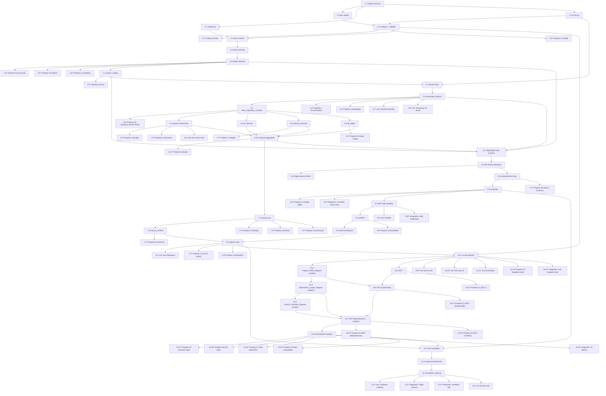

# Implementation Plan: Project Knowledge MCP Server

## Overview

This plan implements the Project Knowledge MCP Server in **Python 3.11+**. The implementation language was chosen because:

- The official MCP Python SDK is mature and supported.
- Hypothesis is a first-class property-based testing library and a canonical fit for the design's 30 correctness properties (each test runs `max_examples=100`).
- SQLite ships in the standard library and matches the design's snapshot-based `Knowledge_Store` with atomic-pointer-swap semantics.
- Python's `ast` module (with `libcst`/`ast-grep` as needed) covers the `Project_Analyzer`'s static-inspection needs.
- Starlette + Uvicorn cover the loopback `Visualization_Server` requirement cleanly.
- Jinja2 renders the `Project_Knowledge_Diagram` HTML; Mermaid is embedded inline for the `Dependency_Graph_Diagram` and `Conflict_Overview_Diagram` (the design notes either Mermaid or server-side SVG is acceptable).

The plan is organized as phases that follow the dependency order: project setup → data models → `Knowledge_Store` (snapshot core) → `GitLab_Connector` → `Project_Analyzer` → `Conflict_Detector` → `Project_Catalog` → `Ingestion_Coordinator` → MCP transport + tools → `Visualization_Server` + Diagram Renderer → wiring/startup/shutdown → final test pass.

Conventions used throughout:

- Every task references the requirements it implements (e.g. _Implements Requirements 7.1, 7.3, 7.4_) and the design property/properties it targets when applicable (_Targets Property 9_).
- Property-based tests use Hypothesis. Each property test source comment uses the design's required tag format: `Feature: project-knowledge-mcp, Property {n}: {property_text}`. Each test is configured with `@settings(max_examples=100)` (minimum 100 iterations).
- Sub-tasks marked with `*` are optional (test-related). Top-level tasks are never optional.

## Tasks

- [x] 1. Project setup
  - [x] 1.1 Create the Python package layout and `pyproject.toml`
    - Create the source tree `src/project_knowledge_mcp/` with empty modules `config.py`, `errors.py`, `models.py`, `knowledge_store.py`, `project_catalog.py`, `gitlab_connector.py`, `project_analyzer/__init__.py`, `conflict_detector.py`, `ingestion_coordinator.py`, `mcp_server.py`, `visualization_server.py`, `diagram_renderer.py`, `scheduler.py`, `main.py`.
    - Create `tests/unit/`, `tests/property/`, `tests/integration/` directories with `__init__.py` files.
    - Write `pyproject.toml` declaring Python 3.11, dependencies (`mcp`, `starlette`, `uvicorn`, `jinja2`, `httpx`, `pydantic`), dev dependencies (`pytest`, `hypothesis`, `pytest-asyncio`, `mypy`, `ruff`).
    - _Implements: project structure prerequisite for all later requirements_
  - [x] 1.2 Configure development tooling
    - Add `pytest.ini` (or `[tool.pytest.ini_options]`) configuring `testpaths = ["tests"]` and registering markers `unit`, `property`, `integration`.
    - Add `ruff` and `mypy` configuration in `pyproject.toml` set to strict-ish defaults.
    - Add a Hypothesis profile named `ci` setting `max_examples=100`, `deadline=None`, registered in `tests/conftest.py`.
    - _Implements: tooling baseline used by all subsequent test tasks_


- [x] 2. Data models, errors, and configuration validator
  - [x] 2.1 Implement `Project_Profile` and supporting dataclasses in `models.py`
    - Define `Project_Profile`, `Abstract_Input`, `Abstract_Output`, `External_Service_Dependency`, `Database_Table_Dependency`, `SourceLocation`, `Snapshot`, `Skip`, `EnumeratedProject`, `RepositoryContents`, `ConflictResult` per the design's Data Models section.
    - Encode the closed-set enums for input/output categories, service kind, and access mode.
    - Enforce invariants (`len(purpose_summary) <= 1000`; non-null `purpose_summary_reason` when summary is `"unknown"`; one entry per service `name`; one entry per `table_name`).
    - _Implements Requirements 3.1, 3.4, 4.1, 4.2, 4.3, 4.4, 4.5, 4.6, 5.1, 5.2, 5.4, 6.1, 6.2, 6.4, 15.4_
    - _Targets Property 6_
  - [x] 2.2 Implement the error type hierarchy in `errors.py`
    - Define `KnowledgeStoreUnavailableError`, `GitLabAuthError(status_code)`, `GitLabGroupNotFoundError(group_path)`, `IngestionInProgressError`, `ProjectNotInScopeError`, `ConfigError(key, reason)`, `BindError(port, reason)`.
    - Each error carries a structured message used by both MCP and visualization surfaces.
    - _Implements Requirements 2.3, 2.4, 8.6, 10.7, 11.5, 11.6, 11.7, 12.6, 12.8, 14.6_
  - [x] 2.3 Implement `config.py` with the `Config` dataclass and `load_and_validate()` loader
    - Read `gitlab.base_url`, `gitlab.group_path`, `gitlab.access_token`, `analysis.branch` (default `"uat"`), `refresh.interval`, `visualization.port` (default `7345`).
    - Validate each value per the Config Loader / Validator table in the design; for any failure, write a single error line to stderr that names the offending key and exit with a non-zero status code via `sys.exit`.
    - Consolidate every termination-on-startup-failure path here so Requirements 1.4, 1.5, 12.5, and 15.6 share one failure-mode implementation.
    - _Implements Requirements 1.1, 1.2, 1.3, 1.4, 1.5, 12.3, 12.4, 12.5, 15.1, 15.2, 15.6_
    - _Targets Property 1_
  - [x] 2.4 Unit tests for config acceptance happy paths
    - Verify that `load_and_validate()` returns the expected `Config` for fully populated valid env/file inputs (one happy-path test per required key set).
    - _Implements Requirements 1.1, 1.2, 1.3, 12.3, 12.4, 15.1, 15.2_
  - [x] 2.5 Property test for configuration validation at startup
    - Tag: `Feature: project-knowledge-mcp, Property 1: For all configurations in which any of gitlab.base_url, gitlab.group_path, gitlab.access_token, analysis.branch (when present), or visualization.port (when present) is missing, empty when not allowed, or otherwise outside its declared validation rule, the MCP_Server SHALL fail startup before either surface accepts traffic, emit an error message that names the offending configuration key, and terminate the process.`
    - Use Hypothesis to generate config dicts that mutate exactly one field into an invalid value; assert process termination with stderr line that names the offending key. `@settings(max_examples=100)`.
    - **Property 1**, **Validates Requirements 1.4, 1.5, 12.5, 15.6**

- [x] 3. Knowledge_Store snapshot core
  - [x] 3.1 Implement the SQLite schema and `Knowledge_Store` skeleton
    - In `knowledge_store.py`, open a SQLite connection (WAL mode), create tables `snapshots`, `project_profiles`, `ingestion_skips`, `current_snapshot` exactly per the design's Conceptual Schema.
    - Implement `open(path)` and `close()` lifecycle helpers.
    - _Implements Requirement 7 (foundational schema for 7.1, 7.3, 7.4)_
  - [x] 3.2 Implement the writer interface
    - Implement `begin_snapshot(trigger, parent_snapshot_id=None) -> int`, `write_profile(snapshot_id, profile, produced_at, commit_sha)`, `record_skip(snapshot_id, gitlab_project_id, reason, detail)`, `abort_snapshot(snapshot_id)`.
    - Implement `commit_snapshot(snapshot_id)` as a single SQLite transaction that updates `current_snapshot.snapshot_id` only after the snapshot row's status flips to `"completed"` — this is the atomic-pointer-swap that Properties 9 and 11 depend on.
    - For `single_project` triggers, copy all profile and catalog rows from `parent_snapshot_id` into the new snapshot before any per-project writes.
    - _Implements Requirements 7.1, 7.3, 7.4, 8.4, 8.5, 14.2_
    - _Targets Property 9, Property 11_
  - [x] 3.3 Implement the reader interface
    - Implement `get_current_snapshot_id() -> int | None`, `get_profile(gitlab_project_id) -> Project_Profile | None`, `list_profiles() -> list[Project_Profile]`, `get_snapshot_metadata() -> SnapshotMetadata | None`.
    - All reads consult `current_snapshot.snapshot_id` and never observe rows from non-committed snapshots.
    - On underlying storage failure, raise `KnowledgeStoreUnavailableError`. No in-memory fallback.
    - _Implements Requirements 7.2, 8.4, 8.5, 14.1, 14.2, 14.6_
    - _Targets Property 10, Property 11_
  - [x] 3.4 Property test for write round-trip and last-write-wins within a snapshot
    - Tag: `Feature: project-knowledge-mcp, Property 9: For all sequences of write_profile operations within a single snapshot, for every gitlab_project_id that received at least one write, get_profile(gitlab_project_id) SHALL return the value of the most recent write (after the snapshot is committed and made current), and the persisted record SHALL include produced_at and analysis_branch_commit_sha.`
    - Generate sequences of `write_profile` calls then `commit_snapshot`, and assert `get_profile` returns the last write (with produced_at + commit_sha). `@settings(max_examples=100)`.
    - **Property 9**, **Validates Requirements 7.1, 7.3, 7.4**
  - [x] 3.5 Property test for persistence across restart
    - Tag: `Feature: project-knowledge-mcp, Property 10: For all sequences write* → commit → close → reopen → read*, the values returned by reads after reopen SHALL equal the values written before the close, drawn from the last successfully committed snapshot.`
    - Generate write/commit traces, close and reopen the SQLite-backed store, assert reads return the last committed snapshot's data. `@settings(max_examples=100)`.
    - **Property 10**, **Validates Requirement 7.2**
  - [x] 3.6 Property test for snapshot isolation across all reads
    - Tag: `Feature: project-knowledge-mcp, Property 11: For all sequences of (begin_snapshot, partial_write*, commit_or_abort) operations and any read issued at any point in the sequence, the read result SHALL equal the result of reading from the snapshot that was current immediately before the most recent unfinished begin_snapshot (if any) or the most recent committed snapshot otherwise; readers SHALL never observe partial writes from an in-progress Ingestion_Job, and the Visualization_Server's diagram inputs SHALL be read from the Knowledge_Store at the moment the HTTP request is handled, with no in-memory caching.`
    - Generate interleaved trace of `begin_snapshot`, `write_profile`, `commit_snapshot`/`abort_snapshot`, and `get_profile`/`list_profiles` reads. Assert reads always reflect the most recent *committed* snapshot. `@settings(max_examples=100)`.
    - **Property 11**, **Validates Requirements 8.4, 8.5, 14.1, 14.2**

- [x] 4. Project_Catalog
  - [x] 4.1 Implement `Project_Catalog` (snapshot-scoped) in `project_catalog.py`
    - Add a `project_catalog` table to the `Knowledge_Store` schema (extend the migration in 3.1 if needed) keyed by `(snapshot_id, gitlab_project_id)`.
    - Implement `populate_in_scope(snapshot_id, enumerated_projects)`, `list_in_scope() -> list[{id, full_path}]`, `is_in_scope(gitlab_project_id) -> bool`, all reading from `current_snapshot.snapshot_id`.
    - Catalog entries are written before any analysis runs in an `Ingestion_Job` so that "in-scope but not yet analyzed" can be distinguished from "out of scope" on the Visualization_Server.
    - _Implements Requirements 14.3, 14.5_
  - [x] 4.2 Unit tests for `Project_Catalog`
    - Cover `is_in_scope` true/false, `list_in_scope` ordering, and behavior when `current_snapshot.snapshot_id` is `null`.
    - _Implements Requirements 14.3, 14.5_

- [x] 5. GitLab_Connector
  - [x] 5.1 Implement the GitLab API client wrapper in `gitlab_connector.py`
    - Use `httpx` to authenticate with `gitlab.access_token` and to make GET calls to the configured `gitlab.base_url`.
    - Implement a paginator that follows GitLab's `Link: rel="next"` headers (or `?page=N`) until exhausted.
    - _Implements Requirement 2.5_
  - [x] 5.2 Implement `enumerate_projects()` returning a stream of `EnumeratedProject`
    - Recursively enumerate every descendant project of the configured `gitlab.group_path`.
    - For each project, look up the `Analysis_Branch`'s commit SHA. If the branch does not exist on the project, set `analysis_branch_commit_sha = None` and `branch_missing = True`.
    - On HTTP 401/403, raise `GitLabAuthError(status_code)`. On HTTP 404 for the configured group, raise `GitLabGroupNotFoundError(group_path)`.
    - _Implements Requirements 2.1, 2.2, 2.3, 2.4, 15.4, 15.5_
  - [x] 5.3 Implement `fetch_repository_contents(project_id, commit_sha) -> RepositoryContents`
    - Return file tree + accessor for individual files at the given commit, used by `Project_Analyzer`.
    - Always fetches at the given commit on the configured `Analysis_Branch`, regardless of GitLab's project default branch.
    - _Implements Requirement 15.3_
  - [x] 5.4 Property test for enumeration covering every descendant project
    - Tag: `Feature: project-knowledge-mcp, Property 2: For all group trees (any nesting depth, any number of subgroups, any per-page count from a paginated GitLab API), the GitLab_Connector.enumerate_projects() result SHALL equal exactly the set of projects that are descendants of the configured group, with no duplicates and no omissions.`
    - Use Hypothesis's group-tree generator and a scripted GitLab API fake; assert `set(enumerate_projects()) == descendants_of(group)`. `@settings(max_examples=100)`.
    - **Property 2**, **Validates Requirements 2.1, 2.5**
  - [x] 5.5 Property test for enumerated project metadata completeness
    - Tag: `Feature: project-knowledge-mcp, Property 3: For all enumerated projects produced by an Ingestion_Job, the EnumeratedProject record SHALL contain a non-null gitlab_project_id, full_path, analysis_branch_name equal to the configured Analysis_Branch, and (where the branch exists on the project) analysis_branch_commit_sha.`
    - Generate trees + per-project branch presence; assert each `EnumeratedProject` carries the required fields. `@settings(max_examples=100)`.
    - **Property 3**, **Validates Requirements 2.2, 15.4**
  - [x] 5.6 Property test for fetching the configured Analysis_Branch
    - Tag: `Feature: project-knowledge-mcp, Property 29: For all Ingestion_Jobs and all in-scope projects, the GitLab_Connector SHALL fetch repository contents from the configured Analysis_Branch regardless of the project's GitLab default branch, and the resulting Project_Profile (when produced) SHALL record analysis_branch equal to the configured value and analysis_branch_commit_sha equal to the most recent commit SHA on that branch.`
    - Generate projects whose `default_branch != Analysis_Branch`; assert the connector reads from `Analysis_Branch` and that the resulting profile records the configured value. `@settings(max_examples=100)`.
    - **Property 29**, **Validates Requirements 15.3, 15.4**
  - [x] 5.7 Unit test for HTTP 401/403 abort + report try/finally semantics (single error injection)
    - Inject a `401` once during enumeration; assert that `Ingestion_Coordinator.start_full_refresh()` both aborts the job and surfaces the auth failure with status code, and that if either step itself fails the underlying failure is surfaced (per the design's single try/finally rule).
    - _Implements Requirement 2.3_
  - [x] 5.8 Unit test for HTTP 404 group-not-found
    - Inject a `404` for the configured group; assert `GitLabGroupNotFoundError(group_path)` is raised and the coordinator aborts cleanly.
    - _Implements Requirement 2.4_

- [x] 6. Project_Analyzer (with sub-analyzers)
  - [x] 6.1 Implement the purpose summarizer in `project_analyzer/purpose.py`
    - Read README files (any `README*` at repo root), the GitLab repository description (passed in from enumeration), and source-code metadata (`package.json`, `pyproject.toml`, `pom.xml`, top-level module docstrings).
    - Truncate the produced summary to ≤ 1000 characters.
    - When no source material yields content, return `("unknown", "insufficient source material")`.
    - _Implements Requirements 3.1, 3.2, 3.3, 3.4_
  - [x] 6.2 Property test for purpose summary length bound
    - Tag: `Feature: project-knowledge-mcp, Property 4: For all repositories, the purpose_summary produced by the Project_Analyzer SHALL be at most 1000 characters long.`
    - Generate adversarial repositories (oversized READMEs, long package descriptions); assert `len(profile.purpose_summary) <= 1000`. `@settings(max_examples=100)`.
    - **Property 4**, **Validates Requirement 3.4**
  - [x] 6.3 Property test for content-free repositories yielding the canonical "unknown" result
    - Tag: `Feature: project-knowledge-mcp, Property 5: For all repositories that have no README, no GitLab repository description, and no analyzable source-code metadata containing content from which a purpose summary could be derived, the Project_Analyzer SHALL produce purpose_summary == "unknown" and purpose_summary_reason == "insufficient source material".`
    - Generate content-free repositories; assert the canonical pair. `@settings(max_examples=100)`.
    - **Property 5**, **Validates Requirement 3.3**
  - [x] 6.4 Unit tests for purpose-summary derivation per source kind
    - One test per source: README only, GitLab description only, manifest only (e.g. `pyproject.toml` description), module docstring only. Assert each single source is sufficient.
    - _Implements Requirement 3.2_
  - [x] 6.5 Implement the I/O extractor in `project_analyzer/io_extractor.py`
    - Statically inspect code for HTTP route handlers, scheduled tasks, message consumers/publishers, file I/O, and CLI entrypoints; emit `Abstract_Input` and `Abstract_Output` lists with categories from the closed sets in Requirements 4.3 and 4.4.
    - Empty results MUST be empty lists, never null.
    - _Implements Requirements 4.1, 4.2, 4.3, 4.4, 4.5, 4.6_
  - [x] 6.6 Implement the external service detector in `project_analyzer/external_services.py`
    - Detect HTTP clients with hard-coded base URLs, message broker clients, object-store SDKs, etc.
    - Deduplicate by `name`; aggregate `source_locations` across all detection sites for that service.
    - _Implements Requirements 5.1, 5.2, 5.3, 5.4_
  - [x] 6.7 Property test for external service deduplication
    - Tag: `Feature: project-knowledge-mcp, Property 7: For all repositories, the produced external_service_dependencies list SHALL contain at most one entry per service name, and the union of source_locations across that single entry SHALL equal the set of source locations from which the service was detected in the repository.`
    - Generate repositories that reference the same external service from multiple files; assert exactly one entry per service name and that `source_locations` is the union of detection sites. `@settings(max_examples=100)`.
    - **Property 7**, **Validates Requirement 5.3**
  - [x] 6.8 Implement the database table detector in `project_analyzer/db_tables.py`
    - Detect SQL table references in code, ORM models, and migrations.
    - Aggregate by `table_name`; if both read and write modes are detected for the same table, set `access_mode = "read_write"`.
    - _Implements Requirements 6.1, 6.2, 6.3, 6.4_
  - [x] 6.9 Property test for mixed-mode access yielding `read_write`
    - Tag: `Feature: project-knowledge-mcp, Property 8: For all repositories where a single table is accessed from multiple source locations with both read and write access modes, the produced database_table_dependencies entry for that table SHALL have access_mode == "read_write".`
    - Generate repositories with mixed read/write access on the same table name; assert `access_mode == "read_write"`. `@settings(max_examples=100)`.
    - **Property 8**, **Validates Requirement 6.3**
  - [x] 6.10 Implement the `analyze()` aggregator in `project_analyzer/__init__.py`
    - Wire the four sub-analyzers together; produce a complete `Project_Profile`.
    - On any sub-analyzer exception, append the failed section name to `degraded_sections` and emit default empty values for that section so the `Ingestion_Job` can keep making progress.
    - The aggregator never raises.
    - _Implements Requirements 3.1, 4.1, 4.2, 5.1, 6.1_
  - [x] 6.11 Property test for well-formed Project_Profile sections
    - Tag: `Feature: project-knowledge-mcp, Property 6: For all analyzed projects, the produced Project_Profile SHALL satisfy: abstract_inputs is a list (possibly empty) where every entry has category in {http_request, scheduled_event, message_consumed, file_read, cli_argument, other} and a non-null description, abstract_outputs is a list (possibly empty) where every entry has category in {http_response, message_published, file_written, database_write, external_call, other} and a non-null description, external_service_dependencies is a list (possibly empty) where every entry has a non-empty name, kind in {http_api, message_broker, object_store, cache, auth_provider, other}, and a non-empty source_locations list, database_table_dependencies is a list (possibly empty) where every entry has a non-empty table_name, access_mode in {read, write, read_write}, and a non-empty source_locations list.`
    - Generate diverse repositories; assert the structural invariants on every produced `Project_Profile`. `@settings(max_examples=100)`.
    - **Property 6**, **Validates Requirements 3.1, 4.1, 4.2, 4.3, 4.4, 4.5, 4.6, 5.1, 5.2, 5.4, 6.1, 6.2, 6.4**

- [x] 7. Conflict_Detector
  - [x] 7.1 Implement `classify_pair(profile_a, profile_b) -> ConflictResult` in `conflict_detector.py`
    - Return `kind="indeterminate"` with a justification naming the project(s) when either purpose summary equals `"unknown"`.
    - Otherwise apply a deterministic heuristic (token overlap + canonical responsibility extraction) to detect substantial overlap of primary responsibility or contradictory ownership of the same responsibility. Return `kind="conflict"` only on those bases; otherwise return `kind="no_conflict"`.
    - The justification string is non-empty and references the purpose summaries that drove the classification.
    - _Implements Requirements 9.1, 9.3, 9.4_
  - [x] 7.2 Implement `find_all_conflicts(profiles)` in `conflict_detector.py`
    - Compute the symmetric closure: return at most one entry per unordered pair `{a, b}` where `classify_pair(a, b).kind == "conflict"`.
    - _Implements Requirement 9.2_
  - [x] 7.3 Property test for the shape of `classify_pair` results
    - Tag: `Feature: project-knowledge-mcp, Property 13: For all pairs of Project_Profiles, Conflict_Detector.classify_pair SHALL return a result whose kind is one of {conflict, no_conflict, indeterminate} and whose justification is a non-empty string referencing the purpose summaries that led to the classification.`
    - `@settings(max_examples=100)`.
    - **Property 13**, **Validates Requirement 9.1**
  - [x] 7.4 Property test for `find_all_conflicts` symmetric closure
    - Tag: `Feature: project-knowledge-mcp, Property 14: For all sets of Project_Profiles, Conflict_Detector.find_all_conflicts(profiles) SHALL return exactly the set of unordered pairs {a, b} (with a != b) such that classify_pair(a, b).kind == "conflict", with each unordered pair represented at most once.`
    - Cross-check `find_all_conflicts` against the brute-force enumeration of `classify_pair` over all unordered pairs. `@settings(max_examples=100)`.
    - **Property 14**, **Validates Requirement 9.2**
  - [x] 7.5 Property test for the allowed-basis classification rule
    - Tag: `Feature: project-knowledge-mcp, Property 15: For all pairs of Project_Profiles where classify_pair(a, b).kind == "conflict", neither a.purpose_summary nor b.purpose_summary equals "unknown", and the documented justification SHALL describe either substantially the same primary responsibility or contradictory ownership of the same responsibility; the classifier SHALL never return conflict on any other basis.`
    - Generate pairs and assert that whenever `kind == "conflict"`, neither summary is `"unknown"` and the justification fits the allowed schema. `@settings(max_examples=100)`.
    - **Property 15**, **Validates Requirement 9.3**
  - [x] 7.6 Property test for `"unknown"` purpose forcing `indeterminate`
    - Tag: `Feature: project-knowledge-mcp, Property 16: For all pairs of Project_Profiles where at least one purpose summary equals "unknown", classify_pair(a, b) SHALL return a result with kind == "indeterminate" and a justification stating that the purpose summary is unknown for the named project(s).`
    - `@settings(max_examples=100)`.
    - **Property 16**, **Validates Requirement 9.4**

- [x] 8. Ingestion_Coordinator
  - [x] 8.1 Implement the single-flight state machine in `ingestion_coordinator.py`
    - Use a `threading.Lock` (or asyncio equivalent) plus a CAS `idle → running`. While `running`, retain `snapshot_id`, `trigger`, `started_at`.
    - Reject new starts with `IngestionInProgressError("Ingestion_Job is already in progress")`.
    - _Implements Requirement 8.6_
    - _Targets Property 12_
  - [x] 8.2 Implement the full-refresh job procedure
    - `begin_snapshot("full")`, enumerate via `GitLab_Connector`, populate `Project_Catalog` with the enumeration result, iterate enumerated projects, run `Project_Analyzer.analyze()` and `Knowledge_Store.write_profile()` for each, then `commit_snapshot()`.
    - On `GitLabAuthError` or `GitLabGroupNotFoundError`, `abort_snapshot()` and surface the error.
    - _Implements Requirements 2.3, 2.4, 8.1, 8.4, 8.5, 14.2_
  - [x] 8.3 Implement the single-project refresh job procedure
    - `begin_snapshot("single_project", parent=current_snapshot_id)`; copy parent's profiles + catalog into the new snapshot; if the requested `gitlab_project_id` is not in the parent catalog, `abort_snapshot()` and surface "project not in scope"; otherwise re-analyze only that project, `write_profile`, then `commit_snapshot()`.
    - _Implements Requirements 8.2, 10.7_
  - [x] 8.4 Implement the Analysis_Branch missing skip-and-continue behavior
    - When an `EnumeratedProject` carries `analysis_branch_commit_sha = None`, call `Knowledge_Store.record_skip(snapshot_id, gitlab_project_id, reason="analysis_branch_missing", detail=f"branch '{analysis_branch}' missing on project {gitlab_project_id}")` and continue with the remaining projects.
    - _Implements Requirement 15.5_
    - _Targets Property 30_
  - [x] 8.5 Implement the scheduled refresh in `scheduler.py`
    - When `refresh.interval` is configured, schedule `start_full_refresh()` every interval. If the previous job is still `running`, log a single rejection line (per Requirement 8.6) and schedule the next tick anyway.
    - _Implements Requirement 8.3_
  - [x] 8.6 Property test for at-most-one Ingestion_Job
    - Tag: `Feature: project-knowledge-mcp, Property 12: For all sequences of refresh requests (full or single-project, from MCP tools or the scheduler), at most one Ingestion_Job is in the running state at any moment; every refresh request issued while another job is running SHALL be rejected with the documented "Ingestion_Job already in progress" message and SHALL leave the coordinator state and the Knowledge_Store unchanged; every refresh request issued while the coordinator is idle SHALL be accepted.`
    - Generate randomly interleaved refresh-request traces (full and single-project, from multiple sources), and assert that at most one job is `running` at any moment, that rejected requests do not modify the store, and that idle-state requests are accepted. `@settings(max_examples=100)`.
    - **Property 12**, **Validates Requirement 8.6**
  - [x] 8.7 Property test for missing-Analysis_Branch skip + continue
    - Tag: `Feature: project-knowledge-mcp, Property 30: For all Ingestion_Jobs where the configured Analysis_Branch does not exist on a subset S of in-scope projects, the job SHALL: not produce a Project_Profile for any project in S, record a Skip entry for every project in S with reason == "analysis_branch_missing" and a detail that names both the configured Analysis_Branch value and the project's gitlab_project_id, continue to attempt analysis for every other in-scope project not in S.`
    - Generate group trees in which a random subset of projects lack the configured `Analysis_Branch`; assert no profile for those projects, exact `Skip` records, and that the remaining projects still get analyzed. `@settings(max_examples=100)`.
    - **Property 30**, **Validates Requirement 15.5**
  - [x] 8.8 Integration test for the scheduler under a virtual clock
    - Use a virtual clock to advance time; assert that an `Ingestion_Job` starts every `refresh.interval` and that a tick during a still-running prior job is rejected per Requirement 8.6.
    - _Implements Requirement 8.3_

- [x] 9. MCP transport layer and tools
  - [x] 9.1 Implement the stdio MCP server skeleton in `mcp_server.py`
    - Use the official Python MCP SDK; bind to stdin/stdout. Implement `initialize` returning `{name, version, capabilities: {tools: {}}}`.
    - _Implements Requirements 11.1, 11.2_
  - [x] 9.2 Implement the `tools/list` handler
    - Return the eight tools defined in the design with their input schemas, but only when `tools/list` is explicitly requested. Never emit unsolicited `tools/list` responses.
    - _Implements Requirement 11.3_
    - _Targets Property 18_
  - [x] 9.3 Implement `tools/call` dispatch with argument schema validation
    - Validate args against each tool's input schema; on validation failure return MCP `InvalidParams` whose `data` names the failing argument and the validation rule that failed.
    - On unknown tool name, return MCP `MethodNotFound` with `message: "tool '{name}' is unknown"`.
    - On successful dispatch, call the registered handler and return its tool result.
    - On handler runtime/dependency failure, return a tool result with `isError: true` and `message: "tool execution failed: {reason}"`.
    - _Implements Requirements 11.4, 11.5, 11.6, 11.7_
    - _Targets Property 19_
  - [x] 9.4 Register all eight tools and wire their handlers
    - `list_projects` → `Project_Catalog.list_in_scope()`.
    - `get_project_purpose`, `get_project_io`, `get_project_dependencies`, `get_project_profile` → `Knowledge_Store.get_profile()` under the current snapshot.
    - `list_purpose_conflicts` → `Conflict_Detector.find_all_conflicts(Knowledge_Store.list_profiles())`.
    - `refresh_all_projects` → `Ingestion_Coordinator.start_full_refresh()`.
    - `refresh_project` → `Ingestion_Coordinator.start_single_refresh(gitlab_project_id)`.
    - For project-id-typed tools, return tool result with `isError: true` and `message: "project {gitlab_project_id} is not in scope"` when `Project_Catalog.is_in_scope(id)` is false.
    - _Implements Requirements 8.1, 8.2, 10.1, 10.2, 10.3, 10.4, 10.5, 10.6, 10.7_
    - _Targets Property 17_
  - [x] 9.5 Unit tests for tool registration and basic happy paths
    - Verify that `tools/list` returns exactly the eight tools by name with their schemas, and that each tool's happy path returns the expected shape.
    - _Implements Requirements 8.1, 8.2, 10.1, 10.2, 10.3, 10.4, 10.5, 10.6_
  - [x] 9.6 Unit test for `initialize` response
    - Send `initialize`; assert response contains `name`, `version`, and `capabilities.tools`.
    - _Implements Requirement 11.2_
  - [x] 9.7 Property test for project-id-typed tools rejecting out-of-scope IDs
    - Tag: `Feature: project-knowledge-mcp, Property 17: For all MCP tools that accept a gitlab_project_id argument and any gitlab_project_id value not present in the current Project_Catalog, tools/call SHALL return a tool result with isError: true whose message states that the project is not in scope.`
    - Generate `gitlab_project_id` values not present in the catalog; assert the documented error result. `@settings(max_examples=100)`.
    - **Property 17**, **Validates Requirement 10.7**
  - [x] 9.8 Property test for `tools/list` being solicited and complete
    - Tag: `Feature: project-knowledge-mcp, Property 18: For all MCP sessions, the count of tools/list responses sent by the MCP_Server SHALL equal the count of tools/list requests received from the MCP_Client; every such response SHALL contain exactly the tool set defined by Requirements 8 and 10 with each tool's input schema.`
    - Generate random sessions with varying `tools/list` request counts; assert response count equals request count and content is exactly the eight tools each time. `@settings(max_examples=100)`.
    - **Property 18**, **Validates Requirement 11.3**
  - [x] 9.9 Property test for `tools/call` dispatch correctness
    - Tag: `Feature: project-knowledge-mcp, Property 19: For all tools/call requests, the response SHALL satisfy: if the tool name is in the defined set and arguments validate, the response is a tool result produced by the tool's handler, if the tool name is not in the defined set, the response is an MCP error response indicating the tool is unknown, if arguments fail input-schema validation, the response is an MCP error response that names the failing argument and the validation rule that failed, if the handler raises a runtime or external-dependency failure, the response is a tool result with isError: true whose message names the failure reason.`
    - Generate `tools/call` requests covering valid args, invalid args, unknown tool names, and handlers wrapped to raise injected `KnowledgeStoreUnavailableError` / `GitLabAuthError`. `@settings(max_examples=100)`.
    - **Property 19**, **Validates Requirements 11.4, 11.5, 11.6, 11.7**
  - [x] 9.10 Integration test for the stdio MCP handshake
    - Spawn the server as a subprocess, send `initialize` over stdin, parse the response from stdout. Assert the handshake completes per Requirement 11.1.
    - _Implements Requirement 11.1_

- [x] 10. Visualization_Server and Diagram Renderer
  - [x] 10.1 Implement the Starlette + Uvicorn application skeleton in `visualization_server.py`
    - Bind only to `127.0.0.1` and `::1` on the configured port (default `7345`).
    - Apply a request-handler-level deadline so any response begins within 5 seconds.
    - On bind failure: emit `"startup error: visualization.port {port} is already in use"` for `EADDRINUSE`; emit `"startup error: visualization server failed to start: {os_error}"` otherwise; exit with non-zero status. Consolidates with task 2.3 to satisfy Requirements 12.5, 12.6, 12.8.
    - On successful bind, emit log line `"Visualization_Server ready at http://127.0.0.1:{port}"`.
    - _Implements Requirements 12.2, 12.3, 12.4, 12.6, 12.7, 12.8, 13.9_
  - [x] 10.2 Implement the `Project_Profile_Diagram` renderer in `diagram_renderer.py`
    - Pure function `render_profile_diagram(profile) -> str` using Jinja2.
    - Renders purpose summary, then sections for `Abstract_Inputs` grouped by category, `Abstract_Outputs` grouped by category, `External_Service_Dependencies` labeled by service kind, and `Database_Table_Dependencies` labeled by access mode.
    - Empty section → render the section-specific empty-state message that names the section (e.g. `"No Abstract Inputs detected"`).
    - _Implements Requirements 13.2, 13.6_
  - [x] 10.3 Implement the `Dependency_Graph_Diagram` renderer
    - Pure function `render_dependency_graph(catalog, profiles) -> str` emitting inline Mermaid.
    - Nodes = in-scope projects from `catalog`. Edges: one per shared `External_Service_Dependency` name labeled `"shared external service: {service_name}"`; one per shared `Database_Table_Dependency` `table_name` labeled `"shared table: {table_name}"`.
    - When no edges, still render nodes plus the empty-state message that no shared dependencies were detected.
    - _Implements Requirement 13.3_
  - [x] 10.4 Implement the `Conflict_Overview_Diagram` renderer
    - Pure function `render_conflict_overview(catalog, conflict_pairs) -> str` emitting inline Mermaid.
    - Nodes = in-scope projects. Edges = `Conflict_Detector.find_all_conflicts(profiles)` with each edge labeled by the `Purpose_Conflict` justification string.
    - When `conflict_pairs` is empty, render nodes plus the empty-state message that no purpose conflicts were detected.
    - _Implements Requirement 13.4_
  - [x] 10.5 Implement `GET /` index handler
    - List in-scope projects from `Project_Catalog`, sorted by `gitlab_project_id` ascending. Each entry includes ID, full path, and links to the Project_Profile_Diagram, Dependency_Graph_Diagram, and Conflict_Overview_Diagram.
    - Empty catalog → render `"No Projects are in scope"` and omit per-project list entries.
    - When no `Ingestion_Job` has ever completed (`current_snapshot.snapshot_id is None`), render the "no project knowledge available; run an Ingestion_Job" message and no diagram content.
    - _Implements Requirements 13.1, 14.4_
  - [x] 10.6 Implement `GET /projects/{project_id}` handler
    - Match a digit-only `project_id` regex.
    - In scope + profile present → 200 + `Project_Profile_Diagram`.
    - In scope + no profile persisted → 200 + "Project has not yet been analyzed; run an Ingestion_Job"; no diagram.
    - Not in scope → 404 + HTML stating the requested project is not in scope and including the requested `project_id`.
    - _Implements Requirements 13.2, 13.6, 14.3, 14.5_
  - [x] 10.7 Implement `GET /dependencies` and `GET /conflicts` handlers
    - Read profiles and catalog at request time; call `Conflict_Detector.find_all_conflicts(profiles)` for the conflicts route. No in-memory caching of profile data.
    - When no `Ingestion_Job` has ever completed, render the "no knowledge available" message and no diagram.
    - _Implements Requirements 13.3, 13.4, 14.1, 14.4_
  - [x] 10.8 Implement 404, 405, and 503 handlers and the fixed `Content-Type`
    - Non-matching path → 404 + HTML body that includes the requested path verbatim and states the page does not exist.
    - Non-GET method on `/`, `/projects/{digits}`, `/dependencies`, `/conflicts` → 405 with `Allow: GET` (header value exactly `"GET"`).
    - On `KnowledgeStoreUnavailableError` → 503 + HTML stating project knowledge is temporarily unavailable; never serve cached profile data.
    - All HTML responses use `Content-Type: text/html; charset=utf-8`.
    - _Implements Requirements 13.5, 13.7, 13.8, 14.6_
  - [x] 10.9 Unit test for the port-already-in-use error
    - Bind a socket to the configured port first, then attempt server startup; assert it terminates with the documented error line.
    - _Implements Requirement 12.6_
  - [x] 10.10 Unit test for the startup URL log line
    - Capture stdout/stderr or the logger; assert the `"Visualization_Server ready at http://127.0.0.1:{port}"` line is emitted exactly once after bind.
    - _Implements Requirement 12.7_
  - [x] 10.11 Unit test for non-port-in-use bind failures
    - Inject a generic `OSError` from the bind call; assert the documented `"visualization server failed to start: {os_error}"` line and process termination.
    - _Implements Requirement 12.8_
  - [x] 10.12 Property test for loopback-only binding
    - Tag: `Feature: project-knowledge-mcp, Property 20: For all network interface addresses, the Visualization_Server SHALL accept HTTP connections on 127.0.0.1 and ::1 and SHALL NOT accept HTTP connections on any other address.`
    - Use Hypothesis to enumerate candidate interface addresses; assert connection succeeds only on `127.0.0.1` and `::1`. `@settings(max_examples=100)`.
    - **Property 20**, **Validates Requirement 12.2**
  - [x] 10.13 Property test for `GET /` response shape
    - Tag: `Feature: project-knowledge-mcp, Property 21: For all Project_Catalog states (including empty), GET / SHALL return HTTP 200 with an HTML body that: if the catalog is non-empty and a snapshot is current, contains exactly one list entry per in-scope project ordered by gitlab_project_id ascending, where each entry includes the project's ID, full path, a link to its Project_Profile_Diagram, a link to the Dependency_Graph_Diagram, and a link to the Conflict_Overview_Diagram, if the catalog is empty, contains the empty-state message "No Projects are in scope" and no per-project list entries, if no Ingestion_Job has ever completed, contains the "no project knowledge available; run an Ingestion_Job" message and no diagram content.`
    - Generate catalog states (empty, populated, no-snapshot); assert response shape. `@settings(max_examples=100)`.
    - **Property 21**, **Validates Requirements 13.1, 14.4**
  - [x] 10.14 Property test for `GET /projects/{project_id}` response shape
    - Tag: `Feature: project-knowledge-mcp, Property 22: For all digit-only project_id values, GET /projects/{project_id} SHALL return: HTTP 200 with a Project_Profile_Diagram rendering the project's purpose summary, Abstract_Inputs grouped by category, Abstract_Outputs grouped by category, External_Service_Dependencies labeled by service kind, Database_Table_Dependencies labeled by access mode, and a section-specific empty-state message naming each empty section, when the project is in scope and a profile is persisted, HTTP 200 with a "Project has not yet been analyzed; run an Ingestion_Job" message and no Project_Profile_Diagram, when the project is in scope but no profile is persisted, HTTP 404 with HTML stating the project is not in scope and including the requested project_id value, when the project is not in scope.`
    - Generate digit-only IDs covering the three branches. `@settings(max_examples=100)`.
    - **Property 22**, **Validates Requirements 13.2, 13.6, 14.3, 14.5**
  - [x] 10.15 Property test for `GET /dependencies` response shape
    - Tag: `Feature: project-knowledge-mcp, Property 23: For all sets of persisted Project_Profiles, GET /dependencies SHALL return HTTP 200 with a Dependency_Graph_Diagram whose node set equals the in-scope Project_Catalog and whose edge set equals exactly the set of unordered pairs {a, b} for which: a and b share an External_Service_Dependency name (each shared service name produces one edge labeled "shared external service: {service_name}"), or a and b share a Database_Table_Dependency table_name (each shared table produces one edge labeled "shared table: {table_name}"). When no two projects share any dependency, the response SHALL include a visible message stating that no shared dependencies were detected, while still rendering the project nodes (or the empty-state message if the catalog is empty). When no Ingestion_Job has ever completed, the response SHALL show the "no knowledge available" message and no diagram.`
    - `@settings(max_examples=100)`.
    - **Property 23**, **Validates Requirements 13.3, 14.4**
  - [x] 10.16 Property test for `GET /conflicts` response shape
    - Tag: `Feature: project-knowledge-mcp, Property 24: For all sets of persisted Project_Profiles, GET /conflicts SHALL return HTTP 200 with a Conflict_Overview_Diagram whose node set equals the in-scope Project_Catalog and whose edge set equals exactly Conflict_Detector.find_all_conflicts(profiles), with each edge labeled by the Purpose_Conflict justification string. When the conflict set is empty, the response SHALL include a visible message stating that no purpose conflicts were detected, while still rendering the project nodes (or the empty-state message if the catalog is empty). When no Ingestion_Job has ever completed, the response SHALL show the "no knowledge available" message and no diagram.`
    - `@settings(max_examples=100)`.
    - **Property 24**, **Validates Requirements 13.4, 14.4**
  - [x] 10.17 Property test for fixed `Content-Type` on diagram routes
    - Tag: `Feature: project-knowledge-mcp, Property 25: For all HTTP 200 responses from the four Visualization_Server diagram routes (/, /projects/{project_id}, /dependencies, /conflicts), the Content-Type response header SHALL equal exactly "text/html; charset=utf-8".`
    - `@settings(max_examples=100)`.
    - **Property 25**, **Validates Requirement 13.5**
  - [x] 10.18 Property test for unknown-path 404 with the requested path in the body
    - Tag: `Feature: project-knowledge-mcp, Property 26: For all HTTP GET request paths that do not match /, /projects/{digits}, /dependencies, or /conflicts, the Visualization_Server SHALL respond with HTTP 404 and an HTML body that includes the requested path verbatim and that states the requested page does not exist.`
    - Generate arbitrary off-route paths; assert 404 + path-in-body. `@settings(max_examples=100)`.
    - **Property 26**, **Validates Requirement 13.7**
  - [x] 10.19 Property test for non-GET methods producing 405 with `Allow: GET`
    - Tag: `Feature: project-knowledge-mcp, Property 27: For all HTTP methods other than GET against any of the routes /, /projects/{digits}, /dependencies, /conflicts, the Visualization_Server SHALL respond with HTTP 405 and an Allow header whose value is exactly the string "GET".`
    - `@settings(max_examples=100)`.
    - **Property 27**, **Validates Requirement 13.8**
  - [x] 10.20 Property test for 503 across all diagram routes when the store is unavailable
    - Tag: `Feature: project-knowledge-mcp, Property 28: For all HTTP GET requests to /, /projects/{project_id} (digit-only), /dependencies, or /conflicts issued while Knowledge_Store reads raise KnowledgeStoreUnavailableError, the Visualization_Server SHALL respond with HTTP 503 and an HTML body stating that project knowledge is temporarily unavailable, and SHALL NOT include any Project_Profile-derived content drawn from caches or in-memory state.`
    - Use the failure-injection wrapper around `Knowledge_Store` reads; assert 503 + correct body and that no profile-derived content leaks. `@settings(max_examples=100)`.
    - **Property 28**, **Validates Requirement 14.6**
  - [x] 10.21 Integration test for real loopback bind verification
    - Start the server; attempt connections from `127.0.0.1`, `::1`, and (when available) a non-loopback interface address; assert only loopback connections succeed.
    - _Implements Requirement 12.2_
  - [x] 10.22 Integration test for the 5-second response latency
    - Issue HTTP GETs to all four routes against a populated store; assert the server begins sending a response within 5 seconds, measured at the HTTP layer.
    - _Implements Requirement 13.9_

- [x] 11. Wiring, startup, and shutdown
  - [x] 11.1 Implement the `main.py` entrypoint
    - Sequence: `Config.load_and_validate()` → open `Knowledge_Store` → construct `Project_Catalog`, `Conflict_Detector`, `Ingestion_Coordinator` (in `idle`) → bind `Visualization_Server` (emit URL log line on success) → bind MCP transport to stdio → start scheduler if `refresh.interval` is configured.
    - On any startup-step failure, exit non-zero before either surface accepts traffic. Consolidate with task 2.3 and task 10.1 for a single termination path.
    - _Implements Requirements 1.4, 1.5, 7.2, 12.1, 12.5, 12.6, 12.7, 12.8, 15.6_
  - [x] 11.2 Implement startup-load behavior for previously committed snapshots
    - On open, leave `current_snapshot.snapshot_id` as it was at last shutdown; readers serve immediately from the last successful snapshot. If no snapshot exists, `current_snapshot.snapshot_id` is `None` and the visualization "no knowledge available" path activates.
    - _Implements Requirement 7.2_
  - [x] 11.3 Implement the shutdown ordering
    - Stop the `Visualization_Server` from accepting new connections first → close MCP stdio handlers → signal any in-progress `Ingestion_Job` to abort (mark its snapshot `failed`; `current_snapshot` pointer unchanged) → flush and close `Knowledge_Store` → exit.
    - _Implements Requirement 12.9_
  - [x] 11.4 Unit test for shutdown ordering at the function level
    - Use a recording double for each component and assert the call order matches the design.
    - _Implements Requirement 12.9_
  - [x] 11.5 Integration test for single-process verification
    - Start the server; confirm via `os.getpid()` (or equivalent) that the MCP transport, the `Visualization_Server`, and the `Knowledge_Store` connection all live in the same OS process.
    - _Implements Requirement 12.1_
  - [x] 11.6 Integration test for end-to-end shutdown ordering
    - Start the server, send an in-progress refresh request, then send SIGTERM; assert the visualization server stops accepting new connections, MCP stdio closes, the in-flight job is aborted, and the store closes cleanly.
    - _Implements Requirement 12.9_

- [x] 12. Final checkpoint
  - [x] 12.1 Run the full test suite (unit + property + integration) and fix any failures
    - Run `pytest -m unit`, `pytest -m property`, `pytest -m integration`. Resolve any failures.
  - [x] 12.2 Checkpoint - Ensure all tests pass
    - Ensure all tests pass, ask the user if questions arise.

## Notes

- Tasks marked with `*` are optional (test-related) and can be skipped for a faster MVP. Top-level tasks are never optional.
- Each task references the specific requirements it implements and the design property (or properties) it targets.
- All property-based tests use Hypothesis with `@settings(max_examples=100)` (minimum 100 iterations per the design).
- Each property-based test source comment uses the design's required tag format: `Feature: project-knowledge-mcp, Property {n}: {property_text}`.
- Termination-on-startup-failure paths are consolidated across tasks 2.3, 10.1, and 11.1 so Requirements 1.4, 1.5, 12.5, 12.6, 12.8, and 15.6 share one error-emission and exit implementation.
- Snapshot isolation (task 3.2's atomic `commit_snapshot`) is the linchpin of Property 11 and the reason both surfaces can read concurrently with an in-progress `Ingestion_Job`.
- `Project_Catalog` (task 4.1) is intentionally separate from `Project_Profile`s so the visualization server can distinguish "in-scope but not yet analyzed" (Requirement 14.3) from "out of scope" (Requirement 14.5).
- The `Analysis_Branch` skip-and-continue behavior (task 8.4) records `reason="analysis_branch_missing"` with a `detail` naming both the configured branch and the project's `gitlab_project_id`, per Requirement 15.5 and Property 30.

## Task Dependency Graph

The graph below shows dependencies between leaf sub-tasks. Tasks within the same execution wave (same `id` in the JSON below) have no inter-task dependencies and can run in parallel; tasks in wave `N` execute only after all tasks in waves `0..N-1` complete. Tasks that write to the same source file are placed in different waves to avoid conflicts. Optional test sub-tasks (marked `*`) are included.

### Visual (Mermaid)



### Wave-based Execution Plan (JSON)

```json
{
  "waves": [
    { "id": 0, "tasks": ["1.1"] },
    { "id": 1, "tasks": ["1.2", "2.1", "2.2"] },
    { "id": 2, "tasks": ["2.3"] },
    { "id": 3, "tasks": ["2.4", "2.5", "3.1"] },
    { "id": 4, "tasks": ["3.2"] },
    { "id": 5, "tasks": ["3.3"] },
    { "id": 6, "tasks": ["3.4", "3.5", "3.6", "4.1"] },
    { "id": 7, "tasks": ["4.2", "5.1"] },
    { "id": 8, "tasks": ["5.2"] },
    { "id": 9, "tasks": ["5.3"] },
    { "id": 10, "tasks": ["5.4", "5.5", "5.6", "5.7", "5.8", "6.1", "6.5", "6.6", "6.8"] },
    { "id": 11, "tasks": ["6.2", "6.3", "6.4", "6.7", "6.9", "6.10"] },
    { "id": 12, "tasks": ["6.11", "7.1"] },
    { "id": 13, "tasks": ["7.2", "7.3", "7.5", "7.6"] },
    { "id": 14, "tasks": ["7.4", "8.1"] },
    { "id": 15, "tasks": ["8.2"] },
    { "id": 16, "tasks": ["8.3"] },
    { "id": 17, "tasks": ["8.4"] },
    { "id": 18, "tasks": ["8.5"] },
    { "id": 19, "tasks": ["8.6", "8.7", "8.8", "9.1"] },
    { "id": 20, "tasks": ["9.2", "9.6"] },
    { "id": 21, "tasks": ["9.3"] },
    { "id": 22, "tasks": ["9.4"] },
    { "id": 23, "tasks": ["9.5", "9.7", "9.8", "9.9", "9.10", "10.1"] },
    { "id": 24, "tasks": ["10.2", "10.5", "10.9", "10.10", "10.11", "10.12", "10.21"] },
    { "id": 25, "tasks": ["10.3", "10.6", "10.13"] },
    { "id": 26, "tasks": ["10.4", "10.7", "10.14"] },
    { "id": 27, "tasks": ["10.8", "10.15", "10.16"] },
    { "id": 28, "tasks": ["10.17", "10.18", "10.19", "10.20", "10.22", "11.1"] },
    { "id": 29, "tasks": ["11.2"] },
    { "id": 30, "tasks": ["11.3"] },
    { "id": 31, "tasks": ["11.4", "11.5", "11.6", "12.1"] }
  ]
}
```
